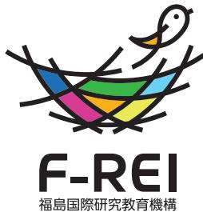

#### **福島国際研究教育機構(F-REI: エフレイ)**

**Fukushima Institute for Research, Education and Innovation**

〒979-1521 福島県双葉郡浪江町大字権現堂字矢沢町6-1 ふれあいセンターなみえ 内 TEL: 0240-41-9970 | E-mail: madoguchi.h5x@f-rei.go.jp | https://www.f-rei.go.jp/

道の駅なみえ●

JR 浪江駅

浪江町●

至 いわき

6

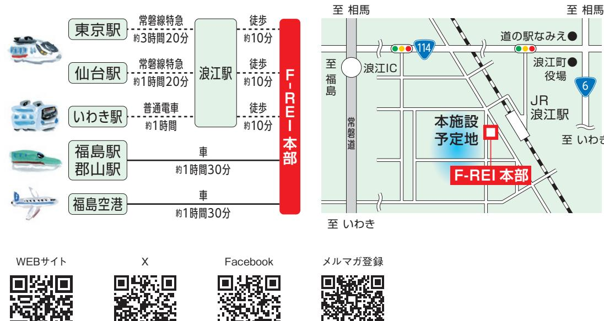

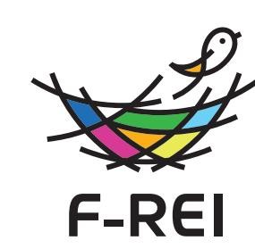

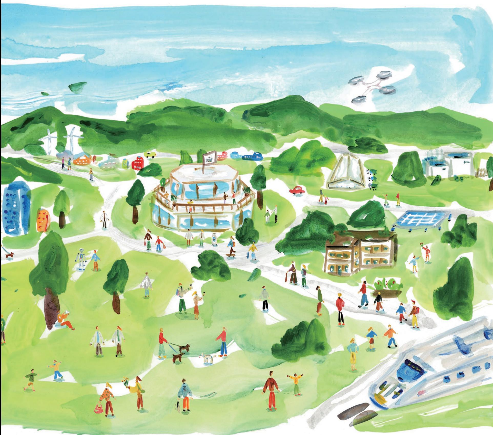

## **世界の夢や希望となる**

福島・東北に生まれた復興への夢や希望が、 世界の人々の夢や希望になる。これは、今から すこし先の、未来の話です。

福島県浜通り地域に活動の拠点をおく F-REI(エフレイ)。ここには、福島ならではの研究 開発や、福島にしかない実証フィールドなど、 福島という地に魅力を感じた研究者や起業家 たちが集い、イノベーションの創出に向けて、 世界トップ水準の研究に取り組んでいます。 森林や田畑は、ロボットやドローンによって 人々が大変な作業をすることなく適切に管理 されています。管理が行き届いた森林はたく さん の 水を蓄え 、その 水 が 山 から地 下 水と なって川へゆっくり流れ出ます。流れ出す水が 農地をうるおし、ゆたかな農産物を育みます。 F-REIの研究から生まれた成果は、新しい産 業を生み出すとともに、これまでに地域に根付 いた企業やベンチャー企業などの起業家と結 びつくことで、新たな成長産業を生み出してい きます。そして、その環境に惹かれて、さらに多 くの人々がこの地に定着し、笑顔と賑わいに溢 れています。こうした福 島・東 北の未 来の姿 は、震災からの復興のシンボルとして、世界中 の人々の夢や希望になっていることでしょう。

こうした未来は、すぐには実現できないかも しれませんが、私たちの挑戦は始まっており、 これからも復興の先を見据えて挑戦を続けて いきます。

*Fukushima Institute for Research, Education and Innovation*

# 福 島 国 際 研 究 教 育 機 構

F-REIは、「福島復興再生特別措置法」とい う法律に基づいて、2023年4月に国が設立 した特別な法人です。福島県浜通りの浪江町 (なみえまち)に本部を置き、浜通り地域を中 心とした広域にわたるフィールドを活動の拠 点として、世界でここにしかない研究・実証・ 社会実装の場をつくろうとしています。

#### **創造的復興の中核拠点**

F-REI は、福島をはじめ東北の復興を実現 するための夢や希望となることを目指して誕 生しました。福島の課題に立ち向かい、復興 への道とその先の未来を切り拓くためには、 産業や社会のしくみを転換できるイノベー ションが必要で、そのイノベーションの創出に は、将来を見据えた研究開発が不可欠です。

F-REIは研究者たちが国内外に誇れる研究 開発に取り組めるように世界水準の環境を整 え、研究から生まれた成果を福島・東北の復興 に結びつけていきます。さらに、その効果を広 く波及させ、日本の「科学技術力」と「産業競争 力」を世界トップレベルへと牽引することによ り、福島から世界へ、復興の取組を日本の成 長へ、つなげていきます。

#### **4つの機能**

F-REIには大きく4つの機能があり、まず起 点となるのが**「研究開発」**です。福島の優位 性を発揮できる研究分野を見定め、世界トッ プ水準の研究開発を実施していきます。2つ 目は、**「産業化」**。研究から生まれた成果を社 会へ実装し、イノベーションや地域の新たな

産業を創出します。3つ目は、**「人材育成」**。 F-REIの事業をとおして若手研究者や企業の 専門人材を育成するとともに、地域の子ども たちへの教育活動をとおして次世代を担う人 材を育みます。そして4つ目は**「司令塔」**と呼 ばれる機能です。創造的復興の中核を担う拠 点として、復興に向けた関係機関のさまざま な活動を横串でつなぎ、大きな推進力を生み 出します。

(くわしくはP7-8でご紹介します)

#### **5つの研究分野**

世界でも類を見ない複合的な災害を経験 した福島だからこそ、優位性を発揮できる研 究があります。**「ロボット」「農林水産業」 「エネルギー」「放射線科学・創薬医療、**

**放射線の産業利用」「原子力災害に関す るデータや知見の集積・発信」**。F-REIは この5つを研究分野として定め、世界トップ水 準の研究開発を実施していきます。 (くわしくはP9-10でご紹介します)

### **広い地域とつながり、効果を広げる**

福島・東北では、復興に向けた活動がさま ざまなかたちで紡がれてきました。福島イノ ベーション・コースト構想の取組など、これま での活動を大切にしながら、F-REIがそれら をさらに発展させ、横串となって広域連携を 進めることで、研究開発の成果を広く波及さ せ 、復 興 の 先に生まれる未 来を、日 本 全 国 へ、そして世界へと広げていきます。 (P13で主な関係機関の施設をご紹介します)

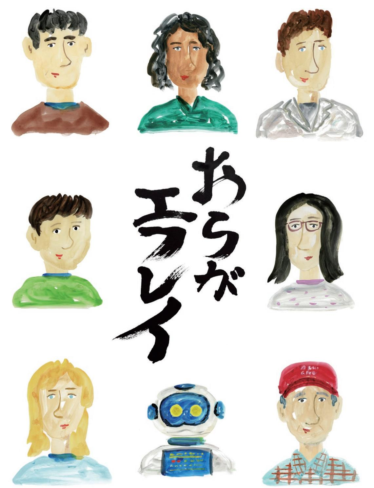

# **世界で最も先端的で、 最もひらかれた場所をめざして。**

F-REIの初代理事長という任を拝命するこ とは、私にとって大きな決断でした。その覚悟 を決めるために、時間をかけて福島県浜通り を視察させてもらい、報道を通して伝わってく る復興の知らせと、現地の実状とのあいだに 乖離があることが分かってきました。

地域外への避難が長く続いたことなどか ら、人口減少や産業の担い手不足、広大な未 活 用 地など、中 長 期 的に取り組むべき課 題 が、ここにはまだまだ残されています。岸田内 閣総理大臣から任命状をいただいた時、"身の 引き締まる思い"というのはこういう時に使う 言葉なのだなと改めて感じ、自分の残りの一 生をぜんぶ懸けてもいいと決意しました。

我 々 は こ れ か ら 福 島・東 北 に 根 ざ し 、 「F-REI は面白いな」と思ってくれる仲間を国 内外から集めて、世界トップ水準の研究開発 に取り組んでいきます。まずはこの地域に環 境をしっかりと整備して研究成果をあげるこ とが第一歩ですが、その成果によって地域に 産業が起こり、地域のなかに人材が育ち、ゆ くゆくは地元出身の人たちが研究者や研究 支援者となって活躍していく。そんな拠点づ くりをめざしています。

研究施設も閉ざされた場所ではなく、敷地 内で地元の人たちが犬と散歩をしていたり、 子どもたちの実験教室がひらかれたり、研究 者たちも積極的に外へ出て行って地域の 人々と一緒になってまちづくりにかかわった り。ここに集う人たちの人生がゆたかな彩り

にあふれ、一人ひとりが「おらがエフレイ」と 誇りをもって言える場所に育ってほしいと 願っています。

そしてこれは、私の個人的な願いではあり ますが、例えばアメリカの人々が西海岸での 暮らしを夢見るように、福島県浜通りがいつ か、「常磐カリフォルニア」と呼ばれ、日本一 住みたい地域として人々の憧れになってくれ ることを強く望んでいます。

「あの時F-REI が始まったから、今がある」。 未来を生きる人たちが、そんな風に思ってくれ る活動をめざして、一つひとつ成果を積み上 げ、福島・東北のため、日本のために貢献でき るよう全身全霊で取り組んでまいります。皆 様のご支援ご協力をお願い申し上げます。

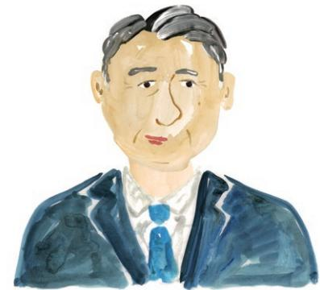

**福島国際研究教育機構(F-REI)理事長 山崎 光悦(やまざき・こうえつ)**

富山県出身。1976年、金沢大学大学院工学研究科修士課 程修了。1982年、工学博士(大阪大学)。材料力学や設計 工学の研究者として、1994年に金沢大学工学部教授。理 事・副学長を経て、2014年に金沢大学長就任。2022年、 金沢大学特別顧問、復興庁参与。2023年から福島国際研 究教育機構(F-REI)理事長(現任)。

# **F-REI 4つの機能**

# *1* **研究開発**

### **日本を代表する研究基盤をつくり、 国内外に誇れる研究開発を進める**

福島ならではの優位性を発揮できる5つの研究 分野において、世界トップ水準の研究開発を実 施します。世界でも類を見ないほどの複合的な 災害を経験した福島に、日本を代表する世界水 準の研究拠点をつくりあげ、「創造的復興の中 核拠点」として、福島・世界の課題の解決と産業 創生につながる研究に取り組みます。

| 5つの研究分野 |
| --- |
| ロボット |
| 農林水産業 |
| エネルギー |
| 放射線科学・創薬医療、放射線の産業利用 |
| 原子力災害に関するデータや知見の集積・発信 |

### 分野ごとに方針を立て、社会課題の解決に資 する、国内外に誇れる研究開発を実施する

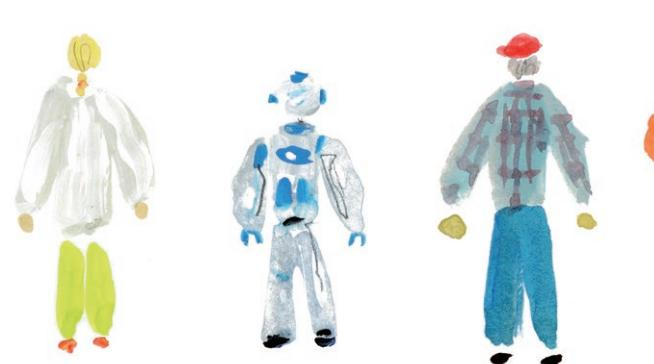

# *2* **産業化**

#### **研究開発の成果を 新しい産業の創出に結びつける**

研 究 開 発 か ら 生 まれ た 成 果 を 、福 島 県 浜 通り地 域を中 心としたフィールドを活かし て 実 証 を 行 い 、新 し い 産 業 の 創 出 、そし て 福 島・東 北 の 復 興 に 結 び つ け ま す 。企 業 や 大 学 、関 係 機 関 と 連 携し 、国 や 地 方 公共団体が取り組む産業化施策とも連携 をはかります。

#### **産業化に向けた取組**

企業との共同研究などができる産学連携体制の構築 広域なフィールドを活かした実証・社会実装 戦略的な知的財産マネジメント方針の策定 セミナー開催などを通じた企業・研究者との連携ネットワークの形成 地域のシーズ・ニーズを把握するための市町村との対話の場 など

研究開発の成果を社会実装し、イノベーショ ンや新たな成長産業を生み出す

F-REIは、「研究開発」「産業化」「人材育成」「司令塔」という4つの機能を併せ持っています。そし て、これらの機能を複合的に結びつけることで、福島・東北の課題を解決へ導くとともに、研究成 果から生まれるイノベーションを活かして日本の産業競争力を世界最高水準に引き上げ、国内外 に効果を波及させていきます。

# *3* **人材育成** *4* **司令塔**

### **地域や学校、企業とともに、 次世代を担う人材を育てる**

F-REIが地域に根ざし、復興の先の未来に貢献 していくために、次世代を担う若者や地域の子 どもたちに向けた人材育成に取り組みます。大 学院や大学・高等専門学校と連携した人材育 成をはじめ、小中高生向けの特色ある実験教 室やセミナーの実施、研究に必要な技術者の 長期的な育成などを効果的に推進します。

#### **人材育成に向けた取組**

F-REIの持つ最先端の研究開発機能を通じた大学院生の研究指導 地元高校生や高専生、大学生が最先端の研究開発を体験する実地研修 小中学生向けの科学教育や出前授業を通じた未来の人材育成 企業人材・社会人向けの専門教育やリカレント教育

研究開発や産業化を担い、長期にわたり復興 をリードしていくF - RE Iの若手研究者を育成 する体制を地元地域に構築する

### **関係機関の活動に横串を刺し、 推進力と波及効果を生み出す**

これまで福島・東北で先行的に進められてきた 復興に向けた活動を大切にしながら、F-REI が 関係機関の連携を推進する役割を担うことで、 大きな推進力を生み出します。新産業創出等 研究開発協議会(F-REI協議会)を組織して、 F-REI設置の効果が広域的に広がるように、協 議会を運営していきます。

**司令塔としての主な役割**

F-REI協議会の組織・運営 大学や高専、自治体や企業との連携協力 施設の統合などによる研究開発体制の全体最適化 福島県内にある既存施設の連携推進の調整

など

#### など

「研究開発」「産業化」「人材育成」の機能を最大 限に発揮できるように関係機関と連携し、復興 への推進力と広域的な波及効果を生み出す

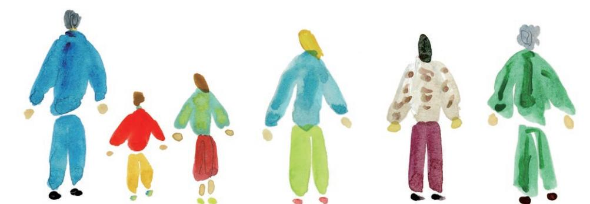

**F-REI 5つの研究分野**

福島の優位性を発揮できる5つの研究分野 において、世界トップ水準の研究開発を実施 していきます。さらに、分野を越えてそれぞ れの研究成果を融合させ、発展させていくこ とで、「創造的復興の中核拠点」として、世界 に誇れる研究開発をリードしていきます。

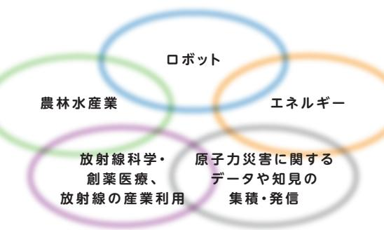

## *1* **ロ ボット**

### **過酷な環境でも活躍できる、 ロボットやドローンをつくる**

複合災害を経験した福島で、廃炉や自然災害が 発生した時の過酷な環境のもとで力を発揮でき るロボットやドローンの研究開発を行います。耐 放射線性や耐水性、耐熱性をそなえ、人が立ち入 れない場所でも自律的・機動的に動作できるロ ボットや、水素を活用したクリーンで高性能なド ローンなどの開発をめざします。

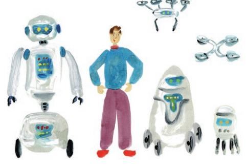

## *2* **農林水産業**

### **森林や田畑に再び息を吹きこみ、 自然と産業を元気にする**

震災の後、大規模な休耕地や人の手が行き届か ない山林が残る福島。ロボットによる農林水産作 業の完全自動化・スマート化をはじめ、木質バイ オマスのエネルギーや新素材としての活用など、 多収益、大規模モデルの確立によって、自然と経 済のゆたかな循環をめざします。

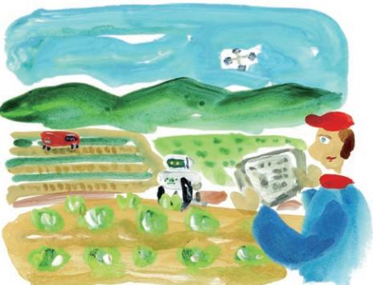

*3* **エネルギー**

## **カーボンニュートラルを地域で実現、 持続可能なコミュニティを育む**

福島をカーボンニュートラル先駆けの地へ。再生可 能エネルギーを中心に、水素エネルギーなどの製 造から貯蔵、輸送、利用まで広く研究開発を行い、 社会実装を目指してリスク評価や技術基準の策定 に必要な研究にも取り組みます。植物や海藻類を 活かしたCO₂の吸収・固定、水素社会に向けたス マートコミュニティの実現にも貢献していきます。

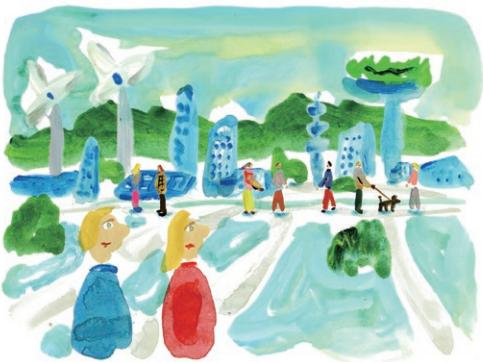

*4* **放 射 線 科 学・創 薬 医 療 、放 射 線 の 産 業 利 用**

### **最先端のがん治療や農業・工業に 放射線科学を活かす**

放 射 線 科 学を、複 合 災 害 からの 創 造 的 復 興 に つながる研究基盤として据え、その利活用につ いて検 討を進 めます。放 射 性 同 位 体(R I)を医 療に応用し、がん等の診断薬・治療薬の研究開 発を行います。また、放 射 線やR Iを農 業や工 業 にも展開して、新たな技術の開発などに取り組 みます。

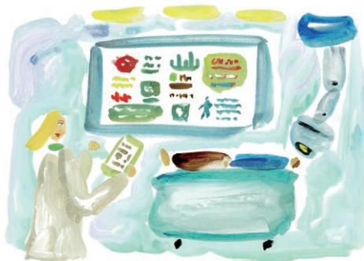

*5* **原 子 力 災 害 に 関 するデ ータや 知 見 の 集 積・発 信**

**福島だから得られるデータや知見を 世界へ向けて発信する**

森林の植生や土壌など、放射能汚染からの回復 にかかる環境動態の計測をはじめ、福島の地で 得られるさまざまなデータを集積し、知見を伝承 することで、今後の災害への対策につなげます。 さらに、社会科学的な知見も活かしながら災害に 強い活気あるこれからのまちづくりに寄与してい きます。

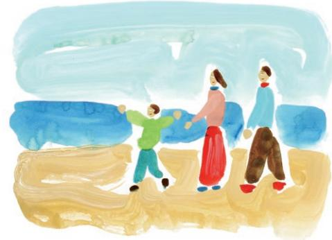

# **森林からつながる、 資源の、ゆたかな循環。**

長引く避難生活や、産業の担い手不足によって、福島に残されていた広大な森林 や田畑。すこし先の未来では、ロボットやドローンたちの活躍によって、再び活用さ れています。

ロボットが成長した樹木を伐採し、水素エネルギーで走行する自動運転のモビリ ティによって運ばれた木材は、新しい素材やエネルギーに、また農業用の肥料へ生ま れ変わり、再生可能な資源として活かされています。森林は、適切に管理されること で、健全になり、小さな伱間が沢山ある保水力の高い土壌が作られます。すると、森に 降った雨はこの土壌を通って地中深くに浸透し、蓄えられ、地下水となって川へゆっく り流れ出ます。この地下水は、農業にも利用され、また海へと流れ込みます。さらに、ド ローンを活用した植林により森林に新たな生命を吹き込み、また適切な管理を行うこ とで木々を育て、再び成長した樹木が活用されることで、「伐って、使って、植えて、育 てる」という資源の循環利用が広がっていきます。

さらに、このような資源の循環は福島だけでなく、豊富な森林をもつ日本では、 さまざまな地域で取り入れることができるため、再生資源大国への道を拓くことが できます。

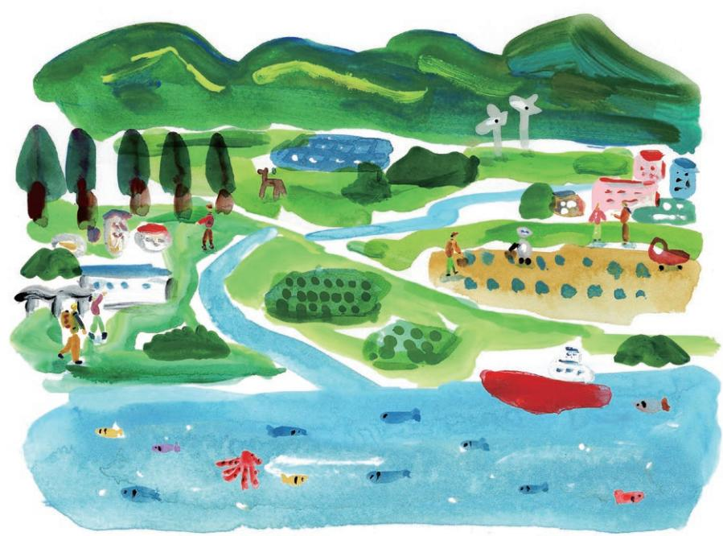

# **「放射線」を理解し、 福島の経験を活かす。**

原子力災害に見舞われた福島だからこそ、できること、そしてやるべきことがあ ります。「放射線」を正しく理解して有効に活用することや、この経験から得られた 知見を未来へとつなげていくことがF-REIの役割の一つです。「放射線」をうまく 使いこなすことで、現代の医療では治すのが難しい病気を治せるようにしたり、果 物や野菜などの農産物の生育のしくみを明らかにして、今よりおいしい農産物を 作れるようにしたり、さまざまな形で人々のウェルビーイングな暮らしの実現に貢 献していきます。

さらに、福島が、どのように複合的な災害からの復興を遂げていくのか。その道 のりを記録し、発信していくことは、世界の人々にとって大きな学びにつながりま す。放射性物質による汚染からの回復など自然科学的なデータはもちろん、地域 のコミュニティがどのように再生と発展に取り組んでいくのかという社会科学的 な知見も、これからの未来を生きる人たちにとって大きな財産となっていきます。

### **主な関係機関の施設**

福島イノベーション・コースト構想による福島ロボットテストフィールドや福島水素エネルギー研究 フィールドの取組など、福島ではこれまでも、復興の先を見据えた先行的な研究開発が進められ てきました。F-REIはその中核拠点として、F-REI協議会を設置するなど、関係機関の施設と綿密 な連携をはかり、取組の効果を全国へと広域的に波及させていきます。

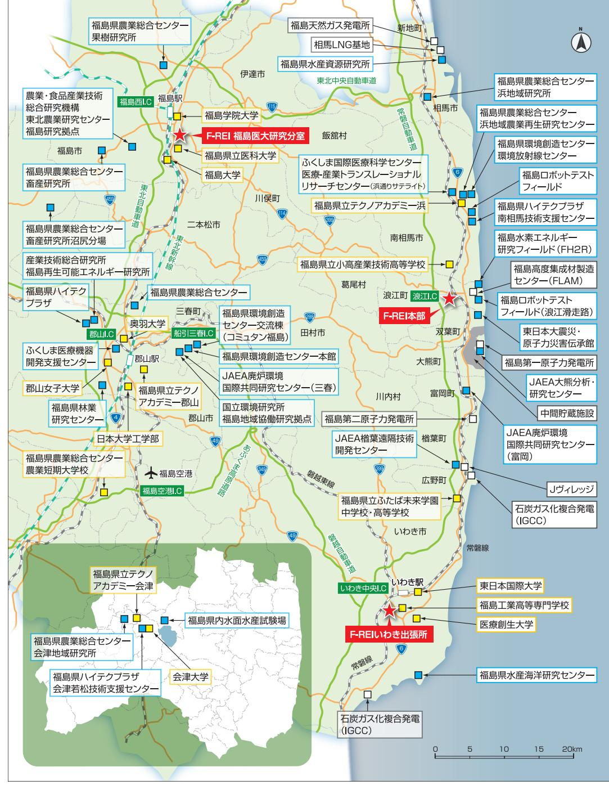

**福島国際研究教育機構(F-REI)** 主な研究施設等 大学・高校等 その他施設等 ※JAEA:日本原子力研究開発機構

2023年4月に発足したF-REIは、2030年3月までの7年間にわたる第1期中期計画を定めていま す。研究代表者を中心とした「研究開発」の体制づくり、施設の整備などを進めるとともに、企業と の共同研究や創業支援などの「産業化」機能、そして、連携大学院や次世代を担う若者に向けたセ ミナーなどを通して「人材育成」機能を発揮し、中長期を見据えて活動を発展させていきます。

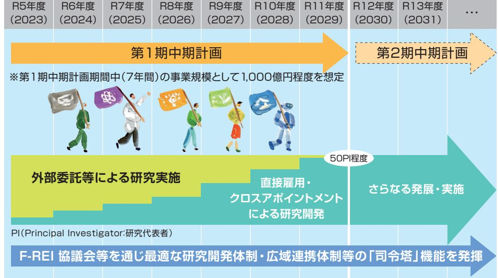

**施設基本計画**

※現時点での想定であり、今後の詳細検討等に伴い変更する可能性がある。

2024年現在、F-REIは福島県浪江町にある「ふれあいセンターなみえ」の一部を借用し、活動して います。今後、国が2030年度末までを目標に、浪江駅の西側に施設を整備する予定です。

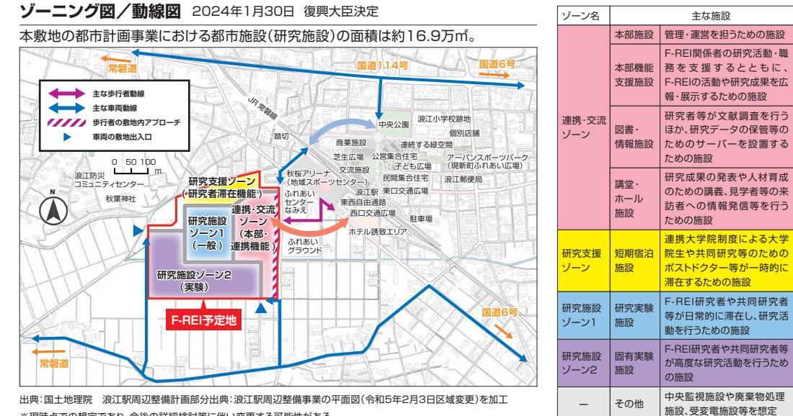

