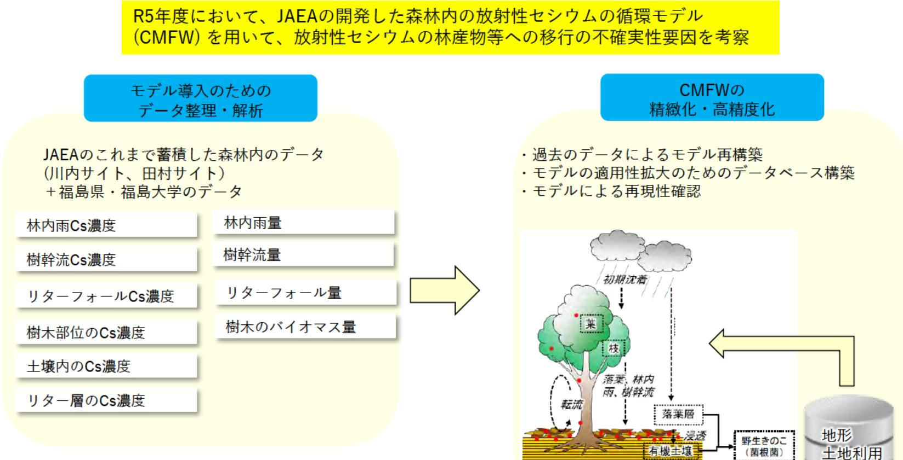

## 環境中の放射性物質の動態への人間活動の影響・移行抑制対策効果の評価手法開発

## (事業概要)

森林等の陸域に沈着した放射性物質への避難解除後の人間活動による影響を評価し、その動きの抑制 対策の妥当性を評価可能にし、福島復興に向けた安全安心なまちづくりに貢献するため、これまでJAEAが 事故以来取得してきた森林内のデータを整理・解析することにより、物質循環モデルの精緻化・高精度化を 図る。

元家信子

理 将十 1年

