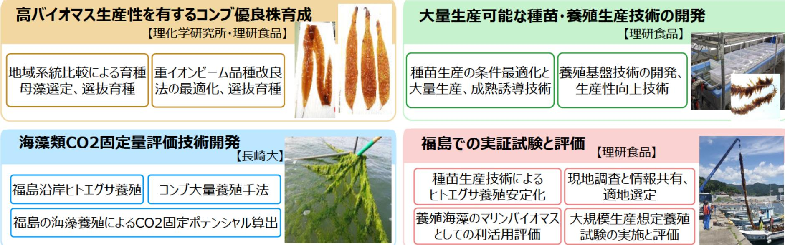

## 【課題名】 バイオエコノミーに対応した海藻類の大量養殖コア技術の研究開発と福島県治岸における 生産拠点形成の実証研究

## 【研究開発の背景と目的】

真水と土壌資源を必要としない海藻類は未来の食糧資源、マリンバイオマス資源、カーボン・オフセット への活用が期待できることから世界的に注目されている。

海藻養殖は日本全国で行われているが、国内の海藻養殖は小規模な経営体に支えられており、バイオマス 資源などの大規模生産に対応した品種、種苗生産技術、養殖技術は存在しない。

本研究事業では、高いバイオマス収量が期待できる1年生マコンブ(以下コンブ)と福島県が全国宿数の 養殖産地であるヒロハノヒトエグサ(以下ヒトエグサ)を原料として、大量養殖生産コア技術開発と、それ によるCO2固定量の定量評価(ブルーカーボン効果)に関する研究を推進する。

## 【研究開発の内容】

## 【期待される研究成果】

- 海藻類の大規模生産に対応した種苗・素殖拠点を整備し、海藻類を食用のみならずバイオマテリアルとし ● て安定供給可能にする事業を目指す。
- 海藻棗殖によるCO2固定量を定量評価し、その方法の国際的な測定基準のひとつとしての確立と、国内外 での幅広い活用を目指す。

