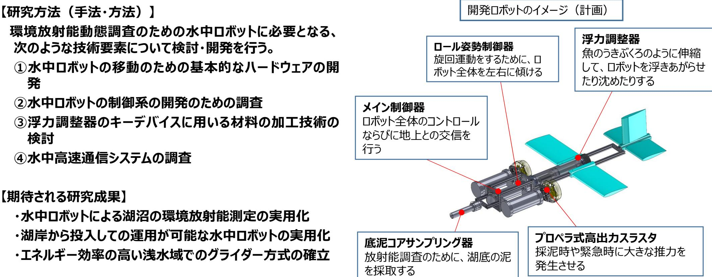

環境放射能動態調査のための水中ロボットの開発と実証 事業概要

**ロボット分野 令和5年度「困難環境下でのロボット・ドローン活用促進に向けた研究開発事業」委託事業 テーマ(3)湖沼、森林内などでの調査に対応するロボット・ドローンの研究開発 募集課題名**

**研究実施者 高橋隆行(国立大学法人 福島大学)**

**実施予定期間 令和11年度まで(ただし実施期間中の各種評価等により変更があり得る)**

## **【背景・目的】**

**湖沼の環境放射能動態調査のための水中ロボットを開発することにより、環境放射能の動態把握の効率化を実現する。**

