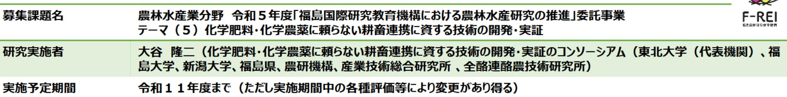
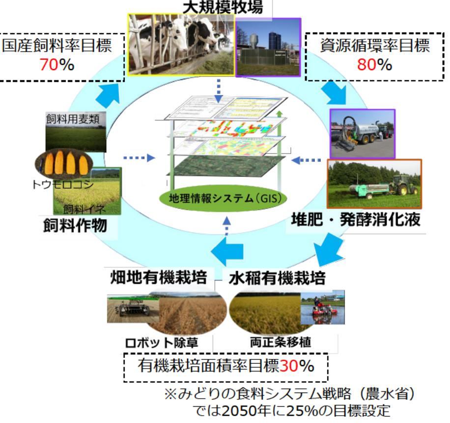

地域循環型の耕畜連携システムの開発および実証 事業概要

## 【背景・目的】

営農再開が進められている福島浜通りの平坦地を中心に、大規模牧場を核とした畜産と耕種経営の飼料・有機物 の循環システムを構築するとともに、ロボット技術を導入した耕種経営での有機栽培体系を確立する。

【研究方法(手法・方法)】

大規模牧場を核とした化学肥料・化学農薬に頼らない耕 畜連携システムを確立するため、下記の技術開発および実 証を行う。

(1)正確な位置情報に基づくロボット除草技術の導入と、 デジタルデータを用いた移植水稲栽培技術の開発を実施し、 有機栽培体系を開発・実証する。

(2) 化学肥料に頼らない飼料生産体系を、発酵消化液の 成分分析センサ、近赤外分光法による土壌診断技術を開発 することで確立し、大規模牧場に国産飼料高度利用飼養技 術として実装する。

(3)地理情報システム(GIS)を導入し、各実施課題の成 果の統合と経済性評価を行う。

【期待される研究成果】

- 水稲および畑作物の省力有機栽培技術の開発。
- 化学肥料に頼らない飼料生産体系および国産飼料高度利 用飼養技術の開発。
- 地域資源循環型営農システムの確立。

