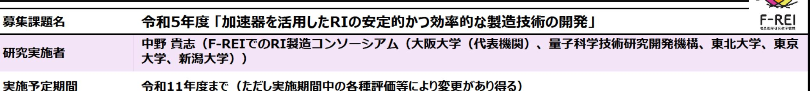
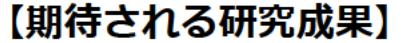
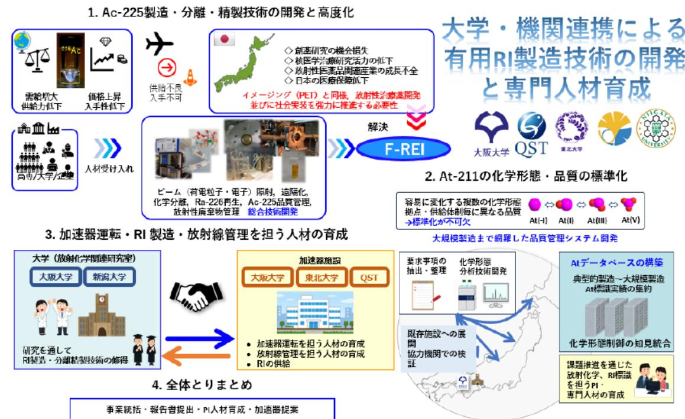

大学・機関連携による有用RI製造技術開発 事業概要

## (背景・目的)

アクチニウム-225(Ac-225)やアスタチン-211(At-211)といった有用なRIの安定的かつ効率的な製造技術 を確立するとともに、その製造技術に必要な専門人材を育成する。

【研究方法(手法・方法)】

・Ac-225の原料のラジウム-226 (Ra-226) は希少であることを踏まえ、Ac-225を安全かつ 効率的に製造・分離・精製するための技術開発を 行う。

・At-211は反応性が高く、環境により様々な化 学形態をとり得ることを踏まえ、At-211の品質 の標準化を目指し、At-211の化学分析や測定手 法の性能確認等を行う。

・研究開発を通じて、加速器の保守・管理・運転、 RI製造・分離・精製、放射線管理等を担う人材 を育成する。

- ・Ac-225の製造・分離・精製技術の高度化
- ・At-211の品質管理の確立
- ・有用RIの製造で即戦力となる専門人材の育成

