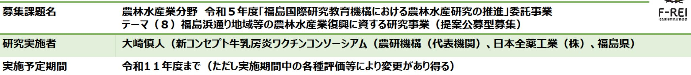
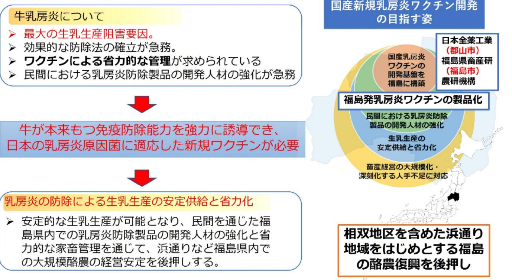

福島から世界へ発信する新しいコンセブトの牛乳房炎ワクチンの開発

## 【背景・目的】

福島県内の略農は、東日本大震災以降、大きな影響を受け、生乳生産量は約7割まで減少した。乳房炎は最大の生乳 生産阻害要因であり、本事業では、牛が本来もつ免疫防除能力を利用し乳房炎原因菌に効果的な新規ワクチンの開発 を目指す。あわせて当該ワクチンによる省力的な管理技術の開発や乳房炎防除製品の開発人材の育成を目指す。

## 【研究方法(手法・方法)】

国産乳房炎ワクチン開発のため の基盤技術の確立に向けて、新規 のワクチン評価系の構築、ワクチ ン製剤組成の設計・最適化、粘膜 免疫と全身免疫を誘導するワクチ ン有効性試験、Target product profileの実現に向けたプロトタイ プワクチンの実証試験を行う。

## 【期待される研究成果】

- 福島発の新規ワクチンによる ● 乳房炎被害の低減を通じた、 安定的な安全で高品質な生乳 生産
- 相双地区を含めた浜通り地域 をはじめとする福島の酪農復 Flee

