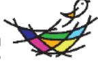
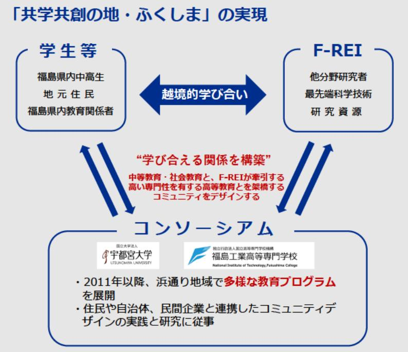

課題解決型地域教育プログラムの開発・実装・発信に関わる実践研究 事業概要

| 募集課題名 | 原子力災害に関するデータや知見の集積・発信分野 令和5年度「福島浜通り地域におけるまちづくり研究 F-REI |
| --- | --- |
|  | 及びラーニング・コミュニティ八ブ整備」 委託事業 |
|  | テーマ(2)福島浜通り地域におけるラーニング・コミュニティハブの整備 |
| 研究実施者 | 石井 大一郎(福島ラーニング・コミュニティバブ・コンソーシアム(宇都宮大学(代表機関)、福島工業高等専門 |
|  | 学校) |
| 実施予定期間 | 令和11年度まで(ただし実施期間中の各種評価等により変更があり得る) |

【背景・目的】

福島浜通り地域内外の学生や住民とF-REIの研究者が学び合い、将来の地域の担い手となる若者による未来課題の解決を実現する。

【研究方法(手法・方法)】

- ●中等教育の現状とニーズを把握し、教育ブログラムを開発・検証する ための、関係者(市町村教育委員会、中学校、高等学校、高専等)が 集う研究会の開催
- ●中高生・高専生向けの国際的かつ独自色あふれる地域教育プログラム の開発・実装
	- ・ウェルビーイングのための科学技術を考える「STEAMカフェ」の 実施
	- ・F-REI研究の理解とF-REI研究者との交流を深める学生参加型の 「STEAMカフェ」の実施

【期待される研究成果】

- 福島浜通り独自の地域教育プログラムの開発
- ●科学的素養を持った人材育成
- ●教育プログラムを支えるラーニングコミュニティ・リーダーの育成

