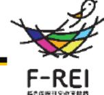
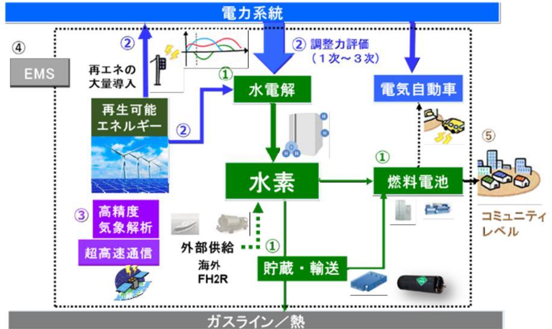
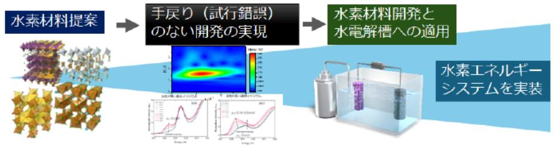

## カーボンニュートラルを実現する水素エネルギーネットワークの研究開発 事業概要

エネルギー分野 令和5年度「水素エネルギーネットワーク構築に関する研究開発」委託事業 テーマ(1)電力・水素エネルギー連携システムの構築、テーマ(2)先端的な水素材料開発環境の構築 河野 龍興(CN水素コンソーシアム(東京大学(代表機関)、東北大学、京都大学)) 針光美施有

令和11年度まで (ただし実施期間中の各種評価等により変更があり得る) 実施予定期間

## 【背景・目的】

2050年カーボンニュートラルとレジリエンスな社会構築を実現するために、再生可能エネルギーから水素を製造・貯 蔵・利用「P2G(Power to Gas)」を高効率化することが必要。本研究ではP2Gの高効率化を目指した水素エネルギー ネットワークの研究開発を行う。

## 【研究方法(手法・方法)】

- 水素製造・貯蔵・輸送及び利用に関する要素技術(材料、装 置、システム)の開発を行い、地域レベルの規模での利用を 想定した小型プロトタイプ(試作機)の水素エネルギーシス テムを構築する。また、1)電気自動車等を再生可能エネル ギーの調整力としての活用、2)高精度気象データ等を活用し た地域エネルギーマネジメント、3)地域のエネルギー需給を 予測・監視・制御、が可能なシステムを研究する。
- 災害時における水素の効果的な利用方法、有用性を評価する。 ●
- 水素エネルギーネットワークの高度化に必要となる触媒等の ● 材料開発を迅速化する手法を開発する。

## 【期待される研究成果】

- 水素を利用した高効率なエネルギーネットワークの構築 ●
- 脱炭素で災害に強いレジリエンスな街づくりへの貢献 ●
- 他地域へも展開できるような次世代スマートシティモデル ● の構築

