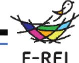
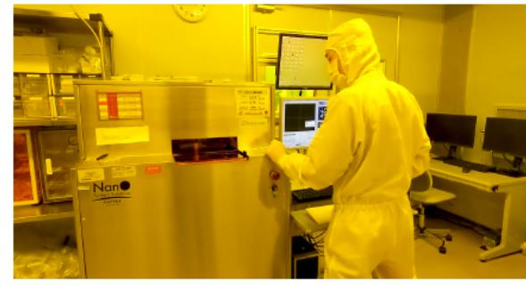
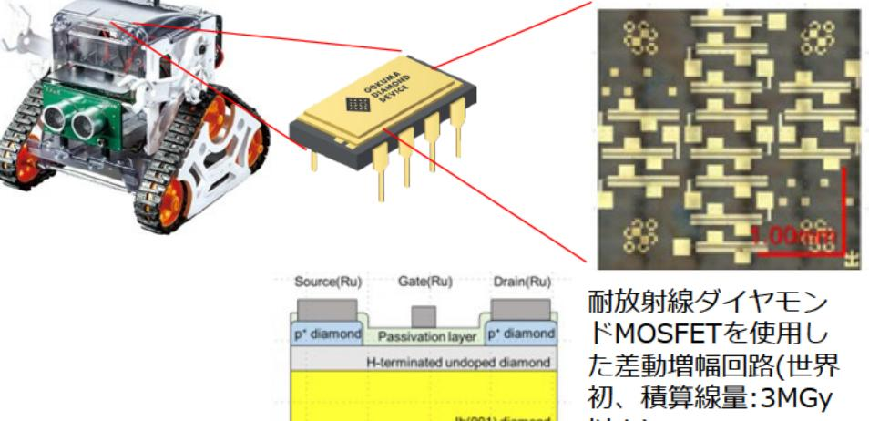

廃炉向け耐放射線性に優れたダイヤモンド半導体の要素技術開発 事業概要

募集課題名 ロボット分野 令和5年度「廃炉向け遠隔技術高度化及び宇宙分野への応用事業」委託事業

純一(廃炉ロボット・宇宙用耐放射線ダイヤモンドデジタル集積回路の要素技術開発コンソーシアム(国立 研究実施者 #子 大学法人 北海道大学(代表機関)、国立研究開発法人 産業技術総合研究所、大熊ダイヤモンドデバイス株式会社、 国立高等専門学校機構 福島工業高等専門学校)

実施予定期間 令和11年度まで(ただし実施期間中の各種評価等により変更があり得る)

(背景・目的)

耐放射線性に優れたダイヤモンド半導体技術により、将来的に廃炉や宇宙環境で使用可能な、ダイヤモンド 半導体を用いたマイクロプロセッサやメモリの開発の基礎となる要素技術開発を行う。

【研究方法(手法・方法)】 ダイヤモンド半導体による以下の要素技術開発を行う。 ①ダイヤモンド半導体によるトランジスタの開発 ②モノリシック抵抗・コンデンサの開発 3 ダイヤモンドモジュールの開発 4イオン注入技術の開発

6各素子による電子回路の開発

【期待される研究成果】

- ・耐放射線が必要な廃炉環境、宇宙環境における ロボットの制御等への応用
- ・高温下でも半導体の機能の発揮が必要とされる 火力発電や宇宙環境等での応用。

以上)

