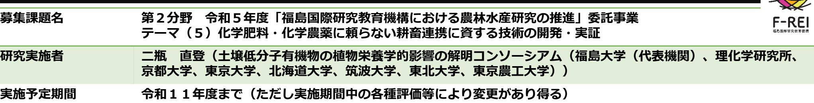
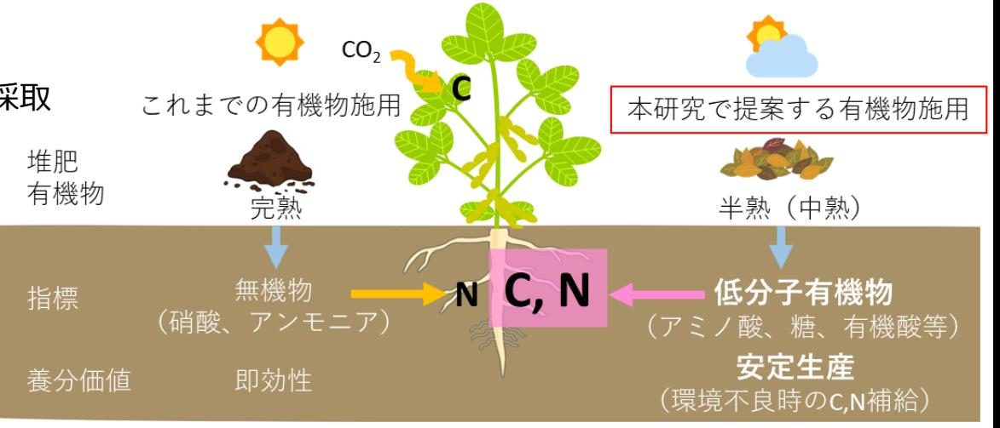

土壌低分子有機物の植物栄養学的影響の解明 事業概要

## **【背景・目的】**

- **【研究方法(手法・方法)】** 有機物施用:効果が千差万別で、**経験と勘**に頼る難しさ 有機物評価:有機物は分解し低分子有機物、無機物となる養分 評価は、無機物の量による評価が基本 放射能汚染:福島県浜通りでは除染として**表土剥取り**を実施 現代農業 :化成肥料依存で**土壌劣化**(世界の33%は劣化, FAO) 有機物施用による**作土層の 回復**(土作り)が急務 植物は低分子有機物を利用する報告もあり、 **新たな視点**で有機物の養分価値を評価 土壌の**低分子有機物**が植物の養分(C,N源)となるか、どのような条件下で**その効果が高い**かを検証
	- ⚫ 福島県内の堆肥連用圃場、慣行圃場等から土壌を採取
	- ⚫ 光、温度等環境条件を変えて作物栽培
	- ⚫ 作物生育に影響を与える土壌の低分子有機物、 微生物叢等の要因を多面的に解明
	- ⚫ 植物が利用する低分子有機物の吸収代謝を解明
	- ⚫ 低分子有機物を活かした栽培法の開発

## **【期待される研究成果】**

- ◎有機物施用の科学的な根拠を示し、肥沃度の新指標の提示による有機農業の拡大につなげる
- ◎安定生産を目的とした堆肥の施用法開発し、適正な有機物の投入量による環境保全に寄与する

