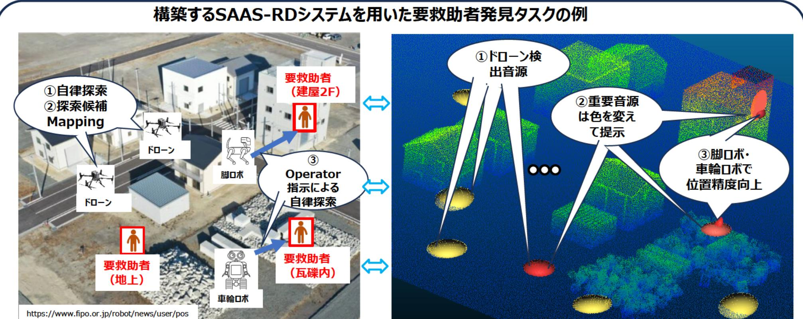

事業名 : アクティブ聴覚を備えた複数ロボット・ドローン協調による要救助者探索技術の構築

## 事業概要 :

本事業では、複数ロボット・ドローンアクティブ聴覚技術(swarm active audition system with robots and drones (SAAS-RD))により、災害現場で活用可能な、要救助者の声から要救助者の位置を効率的かつ高精度に探 索する技術の構築を目指す。構築するSAAS-RDシステムを用いた要救助者発見タスクのイメージを下記に示す。

t-11286

聴覚機能を備えた複数のドローン・ロボットの連携により、以下のステップで要救助者の位置を効率的かつ高精度に探索する。

- 複数ドローンにより、大まかに広範囲を三次元複数音源探査を実施。 (1)
- 音源を種類ごとに異なる色の楕円体(径は誤差に対応)として三次元地図上に探索候補として表示。 (2)
- オペレータ指示を契機に車輪口ボ(フィールド)、脚ロボ(建物内)が自律で現場に赴き詳細捜索し、 (3) 高精度に位置を同定 (定位結果がより小さい楕円体になる)。

