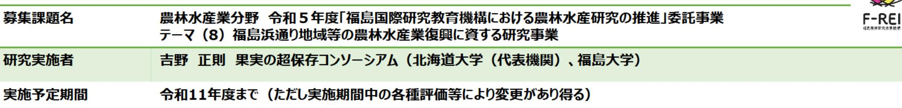
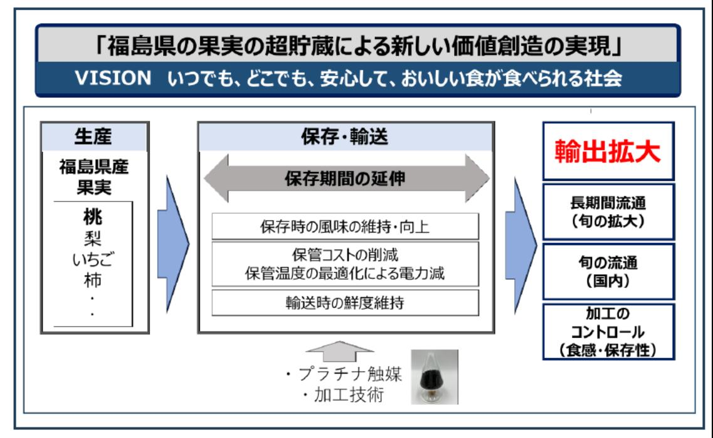

福島の果実の超貯蔵による新しい価値創造の実現 事業概要

## 【背景・目的】

果実は旬の時期が短く、収穫後も短期間で味の劣化、腐敗が生じ長期の保存が困難である。本研究では福島の果実 の長期保管を実現する研究開発を実施し、安定した供給体制を構築することで、海外への輸出拡大を実現する。

【研究方法(手法・方法)】

- 保管時の風味変化を防ぐ新しい研究開発 福島の果実を対象に、保存時における風味変化の原 因物質を酸化分解等の方法で原因物質を除去するプロ セスを開発する。また、乾燥果実の保存期間中の品質 変化を予測する技術を開発する。
- プラチナ触媒を用いた果実・野菜等の保存研究、 実証

プラチナ触媒による低温エチレン除去技術を活用 し、果実の過度の熟成や腐敗の原因となるエチレン を除去し、保管期間を延長する実証を福島県内の生 産地、果実倉庫等において実施する。

【期待される研究成果】

- 福島の果実の保存長期化 ●
- 福島の果実の加工コントロールの実現(食 ● 感、保存性)

