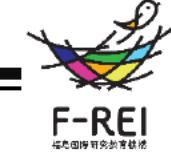
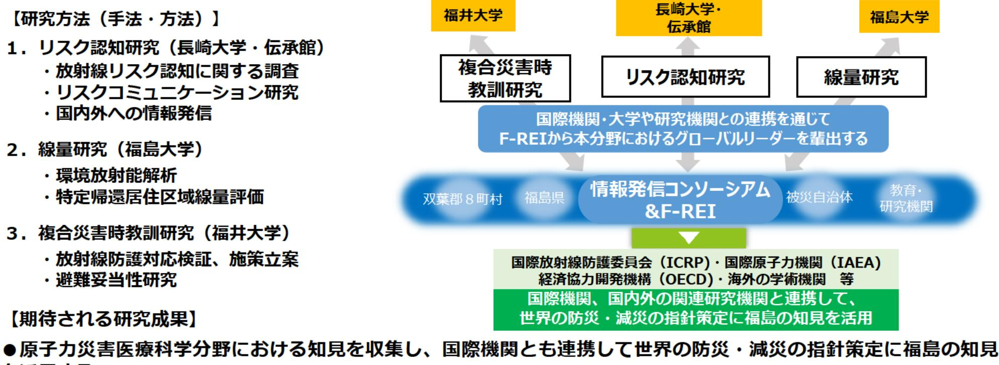

原子力災害に関するデータや知見の集積・発信(原子力災害医療科学)事業概要

| 募集課題名 | 第5分野 令和5年度「原子力災害からの復興に向けた課題の解決に資する施策立案研究」委託事業 | F-REI |
| --- | --- | --- |
| 研究実施者 | 局村 昇 (長崎大学 福島未来創造支援研究センター・センター長) |  |
|  | 原子力災害医療科学分野における福島の知見の集積と国内外への情報発信コンソーシアム |  |
|  | (国立大学法人長崎大学(代表機関)、国立大学法人福井大学、国立大学法人福島大学、公益財団法人福島イノベー |  |
|  | ション・コースト構想推進機構東日本大震災・原子力災害伝承館) |  |
| 実施予定期間 | 令和11年度まで(ただし実施期間中の各種評価等により変更があり得る) |  |

【背景・目的】

を活用する。

福島県には原子力災害を含む複合災害の経験を通じた多くの知見があり、これらの知見を今後の国内外における防災、 減災に活用する必要がある。本事業は、放射線リスク評価など原子力災害医療科学に関する知見を集積・分析し、ICRP、 IAEA等の国際機関をはじめとする国内外の関連研究機関と連携し、国際的な防災・減災の指針の策定に貢献する。

● 上記の取組を通じて、本分野におけるグローバルリーダーをF-REIから輩出する。

