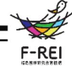

原子力災害に関するデータや知見の集積・発信(放射性物質の魚類への取込・排出メカニズム)事業概要

第5分野 令和5年度「原子力災害からの復興に向けた課題の解決に資する施策立案研究」委託事業 夏生課題名

| 研究実施者 | 和田 敏裕 (福島大学環境放射能研究所 教授) |
| --- | --- |
|  | 原子力災害に関するデータや知見の集積・発信(放射性物質の魚類への取込・排出メカニズム)コンソーシアム |
|  | (国立大学法人 福島大学(代表機関)、国立大学法人 京都大学、福島県(水産海洋研究センター、水産資源研究所、 |
|  | 内水面水産試験場) |
| 実施予定期間 | 令和11年度まで(ただし実施期間中の各種評価等により変更があり得る) |

【背景・目的】

水産物中の放射性物質については、散発的に基準値を超える魚類についての報告事例もあるものの、水産物の放射性物質調査において、 基準値100Bg/kq)を超える割合は事故からの時間の経過とともに低下する傾向がある。本事業では、原子力災害に関するデータや知見の 集積・発信の一環として、放射性物質の魚類への取込・排出メカニズムを多面的なアプローチにより解明することにより、水産物の安全性 の評価などに必要となる科学的な知見を整理する。

【研究方法(手法・方法)】

【期待される研究成果】

1. 海産魚類のバイオロギング放流試験と放射性物質濃度の把握 ヒラメ、マコガレイ、クロソイなどを対象としたバイオロギング放流試験を 行い、水温・深度情報から、個体ごとの経験水温や移動経路、行動パターンを 明らかにする。

2. 淡水魚類の食物網を通じた放射性物質の取込経路の把握

原発周辺に位置する河川やダムで採集した淡水魚や、餌生物等のCs濃度と 炭素窒素安定同位体比分析を行い、食物網を通じた魚類へのCs取込・排出 プロセスを明らかにする。

3. 飼育試験による魚類の137Csと3Hの取込・排出の評価 ウナギやヌマガレイ、ウグイ等を用いて、淡水および海水条件下での 137Csや3Hの取込・排出試験を実施する。

順化期間

3課題の模式図 (左上、右上、下の順)

福島県の漁業復興や風評被害解消の基盤となる、放射性物質の魚類への取込・排出メカニズムに関する知見の整理

