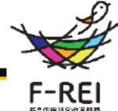
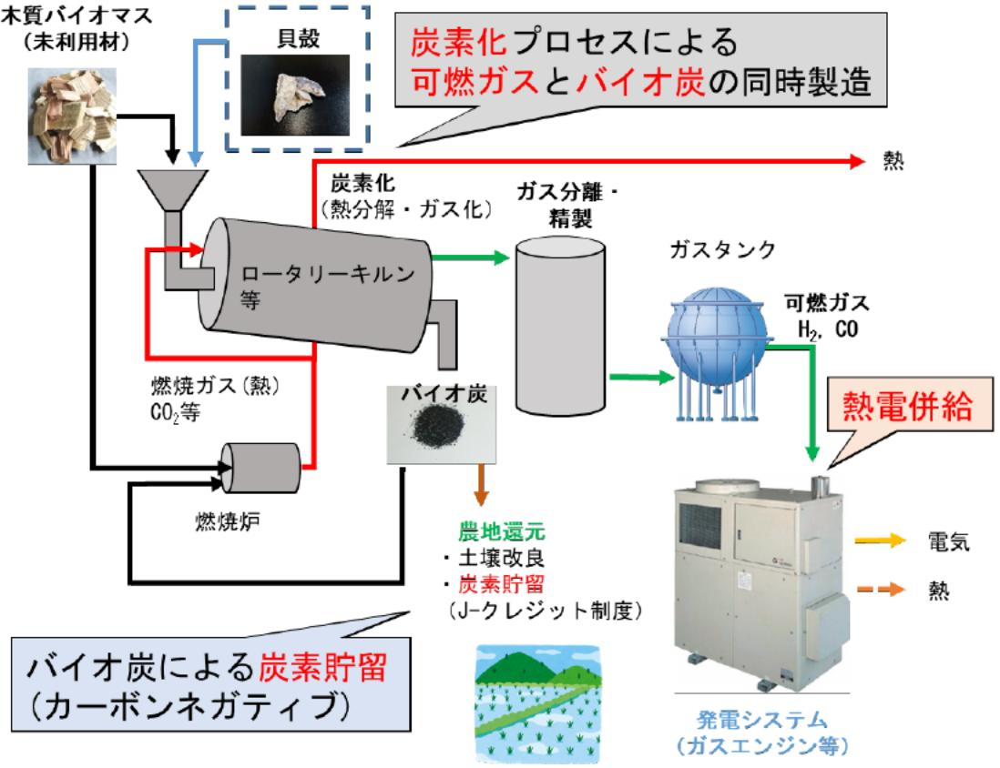

浜通り地域のバイオマス資源を活用したネガティブエミッション技術の実証研究 事業概要

エネルギー分野 令和5年度「ネガティブエミッションのコア技術の研究開発・実証」委託事業 募集課題名 テーマ(1)植物のCO2固定及びネガティブエミッションへの利用に関する研究開発と実証

浅田 降志(福島大学共生システム理丁学類 教授)(浜通り地域の資源を利活用した高効率・循環型ネガティブエミッション・ 研究実施者 地産地消システムコンソーシアム(国立大学法人 福島大学(代表機関)、常磐共同火力株式会社)

実施予定期間 令和11年度まで (ただし実施期間中の各種評価等により変更があり得る)

【背景・目的】

浜通り地域のバイオマス資源を燃料とした地産地消のエネルギー利用システムを構築するとともに、ネガティブエ ミションのコア技術の研究開発として、炭化プロセスで製造されるバイオ炭の農地施用による炭素貯留の効果を確 認・実証する。

【研究方法(手法・方法)】

バイオマスの炭化プロセスから生成する水素や 一酸化炭素等の可燃ガスを燃料として、ガスエン ジン等で熱電併給するエネルギー利用システムを 構築する。また、ネガティブエミッション技術の 研究として、炭化プロセスから生じるバイオ炭の 農地施用による炭素貯留の効果を確認・実証する。

【期待される研究成果】

- バイオマスの炭化プロセスにより、水素や一 酸化炭素などの可燃ガスをエネルギー利用す るシステムの実用化。
- バイオ炭の農地施用による炭素貯留技術の構 ● 築。
- 浜通り地域で発生する未利用材などの木質バ イオマスの持続的な利活用システムの構築。

