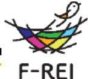
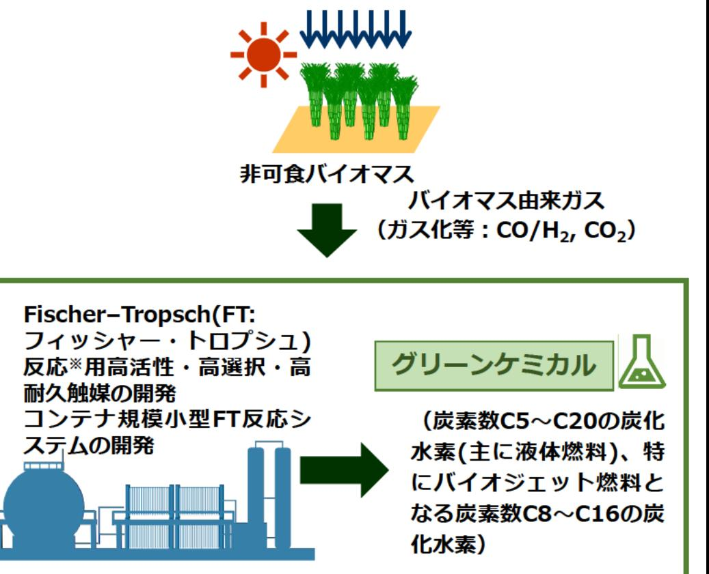

バイオ統合型グリーンケミカルプロセスによるCO,資源化 事業概要

エネルギー分野 令和5年度「バイオ統合型グリーンケミカル技術の研究開発」(バイオ統合型グリーンケミカルブロセスによるCO、資源化 草田間間名

山口 和也(東京大学) 研究実施者

実施予定期間 令和11年度まで (ただし実施期間中の各種評価等により変更があり得る)

## 【背景・目的】

福島におけるバイオマス由来の原料ガス※をカーボンニュートラル炭素の原料とし、再生可能エネルギー由来の水素 も活用して有用なグリーン化学品(主に液体燃料)を得るプロセスの統合化に関する研究開発を行う。

※バイオマスをガス化等することによって得られるCO/H。CO。

【研究方法(手法・方法)】

原子スケールでの反応の理解に基づいた高活性及び 高耐久性を有する触媒を開発し、コンテナ規模の小型 FT合成装置によってグリーン化学品(液体燃料)を 選択的に製造できる製造システムを構築し社会実装す る。

その際に、バイオマス由来の原料生産からグリーン 化学品の製造までの各プロセスについて、経済合理性 を満たしつつ、環境影響が低減されるよう、ライフサ イクル全体での評価を行いプロセスを統合化する。

【期待される研究成果】

- ・カーボンニュートラル社会実現に寄与する先端的な グリーン化学品製造システムの構築
- ・福島におけるバイオマスの有効利用
- ・福島での新産業の創出・誘致・集積

:一酸化炭素(CO)と水素(H2)から触媒反応を用いて炭化水素を合成する反応

