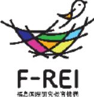
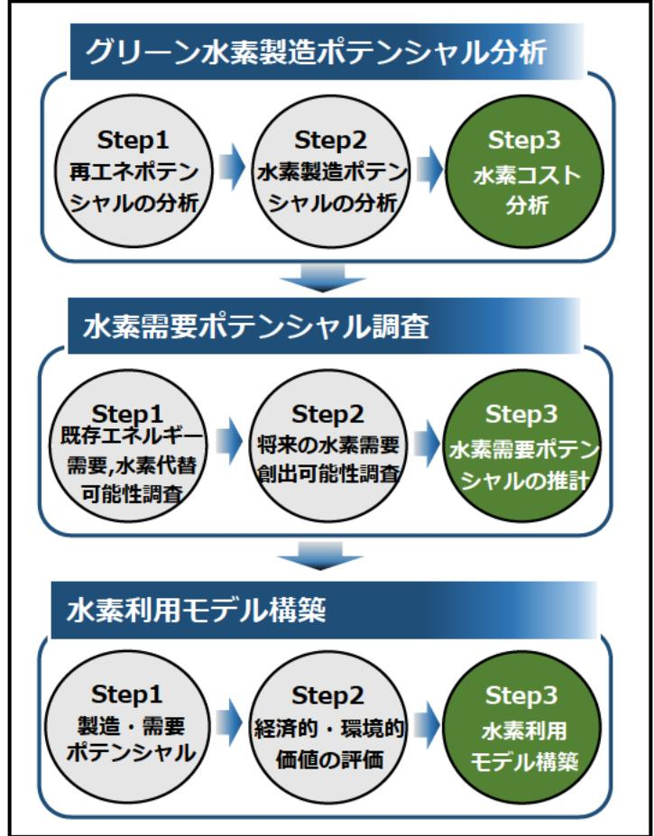

## (福島浜通り地域における水素エネルギーネットワークモデル構築と

モデル実現に向けた水電解水素製造システム開発) 事業概要

募集課題名 エネルギー分野 令和5年度「水素エネルギーネットワークの構築に関する研究開発」委託事業

研究実施者 森田 寛(一般財団法人電力中央研究所 エネルギートランスフォーメーション研究本部)

実施予定期間 令和11年度まで(ただし実施期間中の各種評価等により変更があり得る)

## 【背景・目的】

福島浜通り地域における水素の製造・供給ボテンシャルを分析し、水素利用のネットワーク構築に向けた実現可能性を調 査するとともに、水素の地産地消に適した低コストで雲給調整力等にも富む柔軟な水電解水素製造システムを開発する。

【研究方法(手法・方法)】

水素エネルギーネットワークモデル構築に向けた実現可能性調査等

- 福島浜通り地域の人口動態、産業構造等の特徴を考慮しつつ、グリー ン水素を含む水素の製造ボテンシャル(浜通りにおける水素の原料と なるバイオマスの量等)と水素の需要ボテンシャル(工場等)を調 査・分析し、地域における水素利用のネットワーク構築に向けた実現 可能性を調査する。
- 再生可能エネルギー及び水素利用の経済的・環境的価値を評価できる モデルを構築する。

地産地消に適した水電解水素製造システムの技術開発

- 水電解槽の電源として安価かつ汎用な部品(マイクロコンバータ)を 利用した多数の小型ユニットを並列運転すること等により、低コスト で柔軟な運用が可能な地産地消型の水電解水素製造装置の開発を行う。
【期待される研究成果】

- 地域における水素利用ネットワークモデルの構築。
- 地域のカーボンニュートラル化のために、低コストで再生可能エネル ギー及び水素を利用する手法の構築。
- 水素の地産地消に適した水電解水素製造システムの開発。

福島浜通り地域水素エネルギーネットワークモデルの構築と評価

