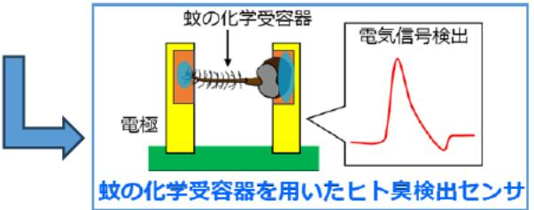
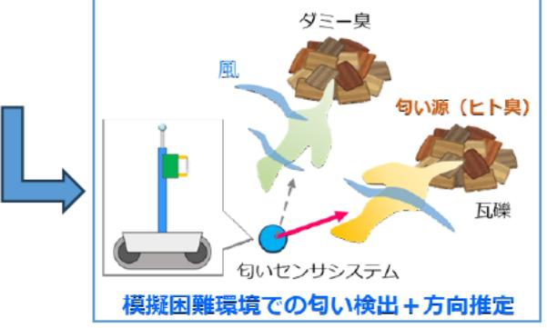
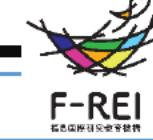

要救助者探査のためのロボット嗅覚の開発 事業概要

募集課題名 ロボット分野 令和5年度「防災・災害のためのドローンのセンサ技術研究開発」委託事業

照月大悟(嗅覚ロボットコンソーシアム(信州大学(代表機関)、千葉大学、慶應義塾大学)) 研究実施者

実施予定期間 令和6年度末まで

## 【背景・目的】

災害下の情報収集や要救助者探査において利用可能なセンサシステムの開発を 目指し、生物嗅覚を利用した匂いセンサと小型風向風速センサを統合した「化 学・物理量センサ」を開発し、ヒト臭の検出と匂い源の方向推定が可能な匂い ?ンサシステムを実現する。

【研究方法(手法・方法)】

- 昆虫の化学受容器(触角など)の応答を電気信号として検出するEAG(触 ● 角電図)を応用した、蚊の化学受容器を用いたヒト臭検出センサの開発
- 開発した上記のセンサを小型風向風速センサと統合することによる匂い源 ● 方向推定精度の向上
- 福島RTFにおける災害環境情報の収集等による、センサ運用環境の明確化 ●

【期待される研究成果】

- (1) 蚊の化学受容器を利用した災害下の要救助者探査センサの実現
- ② 開発センサを有効活用可能な災害環境の明確化・運用シナリオの作成

