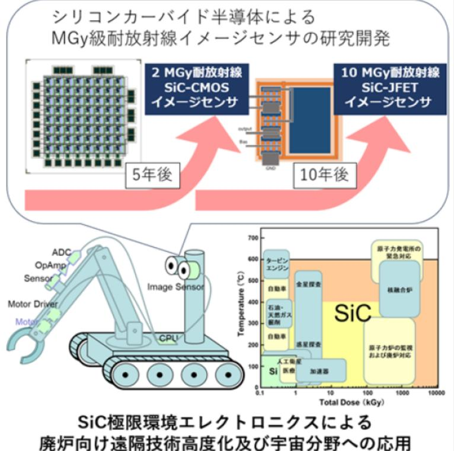

高耐放射線(メガグレイ級)イメージセンサの研究開発 事業概要

募集課題名 ロボット分野 令和5年度「廃炉向け遠隔技術高度化及び宇宙分野への応用事業」委託事業

黒木 伸一郎(ラドハードSiC集積回路研究開発コンソーシアム(国立大学法人 広島大学(代表機関)、国立研究B 研究実施者 発法人 産業技術総合研究所、国立研究開発法人 量子科学技術研究開発機構)

令和9年度まで(ただし実施期間中の各種評価等により変更があり得る) 実施予定期間

【背景・目的】

高い耐放射線性を有するシリコンカーバイド半導体(SiC)によるイメージセンサの研究開発を行う。

【研究方法(手法・方法)】

本研究チームでは小型・軽量な耐放射線SiCイメージセンサ開発に 向け、以下の研究を実施する。

12MGv級耐放射線4H-SiC* CMOSイメージセンサと周辺回路の開発

(10万画素4H-SiC 耐放射線CMOSデジタルカメラの実現) ②10MGv級耐放射線4H-SiC JFET型アクティブビクセルセンサ

(APS) の研究開発

34H-SiCイメージセンサの耐放射線性評価

【期待される研究成果】

・耐放射線性能が必要な廃炉環境における撮像素子への適用。

・高温下、高放射線環境下でも性能の発揮が期待できるため、 宇宙等の極限環境での撮像素子としての適用。

※4H-SiC:シリコンカーバイド半導体で、4Hは結晶構造(ポリタイプ)型を示す。 言語、高電圧、高放射線環境などの厳しい条件下での利用に優れた特性を持つ。

