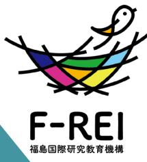

# **F-REIのこれまでの活動実績 (令和5年度)**

#### 福島国際研究教育機構

Fukushima Institute for Research, Education and Innovation (F-REI)

## **F-REI設立後の出来事(令和5年4月)**

| 4月1日 | 福島国際研究教育機構 設立 | 7 |
| --- | --- | --- |
| 4月1日 | 福島高専との基本合意書の締結 | 8 |
| 4月5日 | F-REI福島医大研究分室の開所式 | 9 |
| 4月5日 | 福島医大との基本合意書の締結 | 10 |
| 4月7日 | 中期計画及び助成等業務実施計画の認可 | 11 |
| 4月14日 | F-REI国際アドバイザーの決定 | 12 |
| 4月15日 | F-REIいわき出張所の開所式 | 13 |
| 4月15日 | いわき市との基本合意書の締結 | 14 |
| 4月15日 | F-REI設立記念シンポジウムの開催 | 15 |
| 4月19日 | ICRU国際シンポジウム 開催 | 16 |
| 4月28日 | 令和5年度の年度計画及び助成等業務実施計画を公表 | 17 |

### **F-REI設立後の出来事(令和5年5月~6月)**

| 5月1日 | アドバイザリーボードのメンバーの決定 | 18 |
| --- | --- | --- |
| 5月8日 | 理事長特別顧問の決定 | 19 |
| 5月10日 | 第1回新産業創出等研究開発協議会の開催 | 20 |
| 5月17日 | 福島大学との基本合意書の締結 | 21 |
| 5月17日 | 第1回F-REIトップセミナーの開催(福島大学) | 22 |
| 5月26日 | 東北経済連合会 産業経済委員会での講演 | 23 |
| 5月29日 | 浪江町との基本合意書の締結 | 24 |
| 5月30日 | 会津大学との基本合意書の締結 | 25 |
| 5月30日 | 第2回F-REIトップセミナーの開催(会津大学) | 26 |
| 6月13日 | 第3回F-REIトップセミナーの開催(相馬高校) | 27 |
| 6月20日 | 市町村座談会の開催(いわき市) | 28 |
| 6月30日 | 第4回F-REIトップセミナーの開催(会津学鳳高校・中学校) | 29 |

### **F-REI設立後の出来事(令和5年7月~8月)**

| 7月4日 | 第5回F-REIトップセミナーの開催(会津高校) | 30 |
| --- | --- | --- |
| 7月5日 | 市町村座談会の開催(南相馬市) | 31 |
| 7月13日 | 第6回F-REIトップセミナーの開催(小高産業技術高校) | 32 |
| 7月14日 | 分野長・副分野長の決定 | 33 |
| 7月27日 | 市町村座談会の開催(葛尾村) | 34 |
| 8月3日 | F-REI ロゴマーク選考委員会を開催 | 35 |
| 8月9日 | 市町村座談会の開催(浪江町) | 36 |
| 8月29日 | 市町村座談会の開催(田村市) | 37 |
| 8月31日 | 第7回F-REIトップセミナーの開催(安積高校) | 38 |

## **F-REI設立後の出来事(令和5年9月~10月)**

| 9月1日 | 南相馬市との基本合意書の締結 | 39 |
| --- | --- | --- |
| 9月12日 | 第8回F-REIトップセミナーの開催(ふたば未来学園高校) | 40 |
| 9月25日 | 第9回F-REIトップセミナーの開催(福島工業高等専門学校) | 41 |
| 9月26日 | 第10回F-REIトップセミナーの開催(福島工業高等専門学校) | 42 |
| 9月27日 | 第1回広域連携ワーキンググループの開催 | 43 |
| 9月29日 | 市町村座談会の開催(広野町) | 44 |
| 10月4日 | 第11回F-REIトップセミナーの開催(福島県立医科大学) | 45 |
| 10月4日 | 第12回F-REIトップセミナーの開催(福島高校) | 46 |
| 10月11日 | 市町村座談会の開催(富岡町) | 47 |
| 10月12日 | 第2回F-REI産学官ネットワーク・セミナーの開催 | 48 |
| 10月13日 | 第1回アドバイザリーボードの開催 | 49 |
| 10月15日 | 科学実験教室の開催 | 50 |
| 10月17日 | 市町村座談会の開催(川内村) | 51 |
| 10月23日 | 市町村座談会の開催(新地町) | 52 |
| 10月26日 | 出前授業の実施(福島工業高等専門学校) | 53 4 |

### **F-REI設立後の出来事(令和5年11月~12月)**

| 11月6日 | 市町村座談会の開催(飯舘村) | 54 |
| --- | --- | --- |
| 11月7日 | 第13回F-REIトップセミナーの開催(東日本国際大学) | 55 |
| 11月15日 | 出前授業を実施(早稲田大学) | 56 |
| 11月17日 | 市町村座談会の開催(楢葉町) | 57 |
| 11月21日 | 教職員への講演会の実施(福島工業高等専門学校) | 58 |
| 11月24日 | F-REI説明会の実施(会津大学) | 59 |
| 11月24日 | 第14回F-REIトップセミナーの開催(福島大学) | 60 |
| 11月26日~12月1日 | 国際アドバイザーとの意見交換を実施 | 61 |
| 12月1日 | 第15回F-REIトップセミナーの開催(磐城高校) | 62 |
| 12月4日 | 市町村座談会の開催(大熊町) | 63 |
| 12月7日 | 第16回F-REIトップセミナーの開催(原町高校) | 64 |
| 12月19日 | 市町村座談会の開催(相馬市) | 65 |
| 12月26日 | F-REI説明会の実施(県北・相双地区) | 66 |

## **F-REI設立後の出来事(令和5年1月~3月)**

| 1月 8日 | エフレイ・サイエンスラボ(体験講座)の開催 | 67 |
| --- | --- | --- |
| 1月12日 | 第2回新産業創出等研究開発協議会の開催 | 68 |
| 1月12日 | F-REIロゴマーク最優秀作品の発表について | 69 |
| 1月18日 | 市町村座談会の開催(川俣町) | 70 |
| 1月25日 | 株式会社東邦銀行との包括連携協力協定書の締結 | 71 |
| 1月30日 | 市町村座談会の開催(双葉町) | 72 |
| 2月 1日 | 双葉地方町村議会議員研修会での講演 | 73 |
| 2月21日 | 令和5年度第2回アドバイザリーボードの開催 | 74 |
| 2月23日 | エフレイ・フォーラムの開催 | 75 |
| 3月 8日 | 東北大学との基本合意書の締結 | 76 |
| 3月 8日 | 東北大学と連携大学院(連携講座)を設置 | 77 |
| 3月28日 | 放射性物質の分析人材育成(現地訪問型研修)を開催 | 78 |

#### **令和5年4月1日(土) 福島国際研究教育機構 設立**

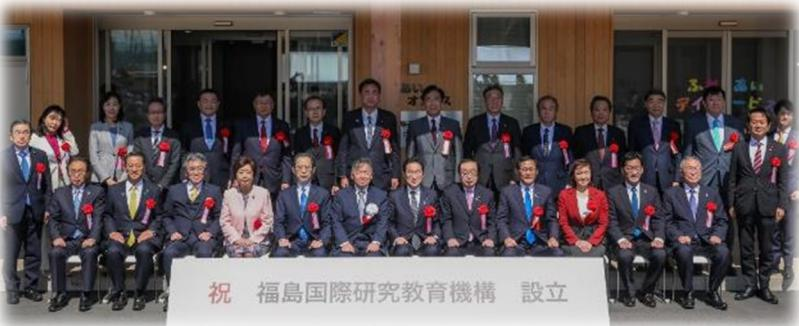

7

福島国際研究教育機構(略称:F-REI)は、福島復興再生特別措置法に基づき、令和5年4月1日に 設立された特殊法人です。福島をはじめ東北の復興を実現するための夢や希望となるものとするとともに、我 が国の科学技術力・産業競争力の強化を牽引し、経済成長や国民生活の向上に貢献する、世界に冠たる 「創造的復興の中核拠点」を目指しています。

同日、浪江町ふれあい福祉センターで開所式を行い、岸田首相や渡辺復興大臣らが出席しました。

(1)F-REIのミッション 福島をはじめ東北の復興を実現 するための夢や希望となるものであ るとともに、我が国の産業競争力を 世界最高の水準に引き上げ、経 済成長や国民生活の向上に貢献 する、世界に冠たる「創造的復興 の中核拠点」を目指すことにありま す。 (2)世界水準の研究推進と 成果の社会実装・産業化 F-REIでは、福島や世界の課題解決 を現実のものとするため、研究開発を行 うのみならず、研究成果の社会実装・ 産業化や人材育成についてもその主要 な業務として取り組みます。あわせて、 福島に既に立地している研究施設等の 取組について横串を刺す調整機能を 持った司令塔としての役割も果たしてま いります。 (3)創造的復興の中核拠点 F-REI設置の効果が広域的に波 及するよう、地域の市町村や住民、 企業・団体等との間で様々な形の パートナーシップで連携し、F-REIの 施設の中だけでなく、施設の外も含め て広域的な実証研究フィールドととら え、「世界でここにしかない多様な研 究・実証・社会実装の場」を実現し、 国際的に情報発信してまいります。

#### **令和5年4月1日(土) 福島高専との基本合意書の締結**

4月1日、福島工業高等専門学校 (福島高専)との間において連携協 力に関する基本合意書を締結しまし た。

今後、この基本合意書に基づき、研 究開発、人材育成等に関する連携 協力を進めてまいります。

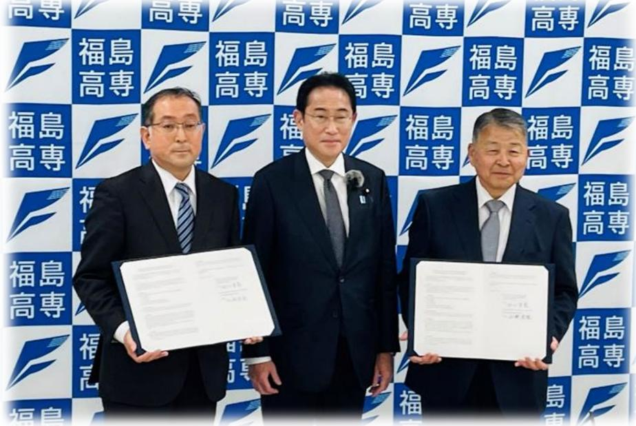

#### **令和5年4月5日(水) F-REI福島医大研究分室の開所式**

4月5日、F-REI福島医大分室の開 所式を開催しました。

F-REI福島医大研究分室は、F-REIと して最初の研究組織である放射生態学 ユニットが置かれます。F-REIの第1期 中期目標期間である7年の間に、研究グ ループを50まで増やし、研究開発体制を 充実していく計画です。

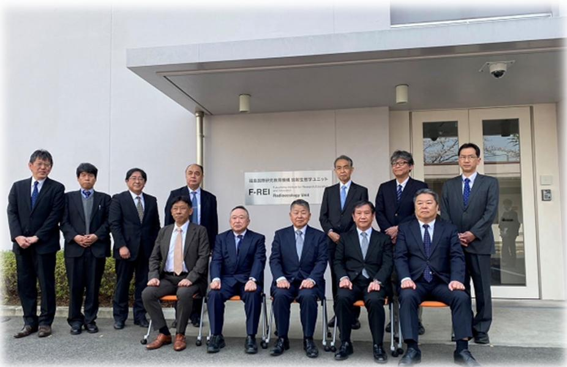

#### **令和5年4月5日(水) 福島医大との基本合意書の締結**

4月5日、福島医科大学とF-REI との連携協力に関する基本合意書 を締結しました(2件目)。

これは、相互の研究開発、人材育 成等の充実を図っていくことを目的と するものであり、今後、この基本合 意書に沿って、互恵的な連携協力 を進めていきます。

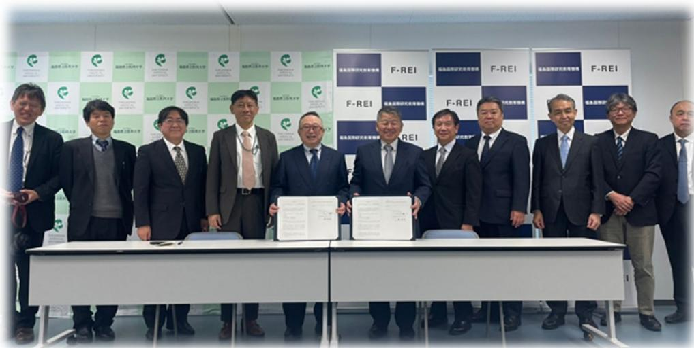

#### **令和5年4月7日(金) 中期計画及び助成等業務実施計画の認可**

4月7日、F-REIの中期計画及び助成等業務実施計画が主務大臣から 認可されました。中期計画は、令和11年度までの7年間における中期目標 を達成するための計画です。

第一期となる本中期目標期間においては、「基盤作りと存在感の提示」に重 点を置くこととし、機構の施設が整備され、その活動が本格的に軌道に乗るこ とが見込まれる第二期中期目標期間(令和12年度~令和18年度)を見 据えながら、たゆむことなく復興に貢献できるよう、取組を進めます。

### **令和5年4月14日(金) F-REI国際アドバイザーの決定**

4月14日、国際的な知見を有する 外部有識者からF-REIの運営等に 関しご助言をいただくため、4名の 外国人有識者に国際アドバイザーと してご就任いただきました。

今後、国際アドバイザーからのご意 見等を踏まえつつ、F-REIの国際連 携や国際的な発信を一層推進して まいります。

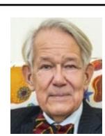

スヴァンテ・ リンドクヴィスト博士 Dr. Svante Lindqvist

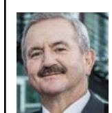

ライムント・ ノイゲバウアー博士

Prof.Reimund Neugebauer 前 フラウンホーファー研究機構理事長

元 スウェーデン王立科学アカデミー会長

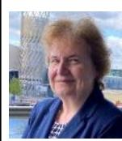

レイモン博士 Dr. Fiona Rayment 英国立原子力研究所フェロー

スレッシュ博士

フィオナ・

Dr. Subra Suresh

前 南洋工科大学長、元 カーネギーメロン大学長

#### **令和5年4月15日(土) F-REIいわき出張所開所式**

4月15日、F-REIいわき出張所開所式 が行われました。これは、量子科学技術 研究開発機構(QST)が保有していた いわき出張所を、F-REIが引き継ぐことと なったものです。

今後、いわき市などとも協議をしながら、 「F-REIの様々な活動の情報発信の場」 など有効な活用を検討していきます。

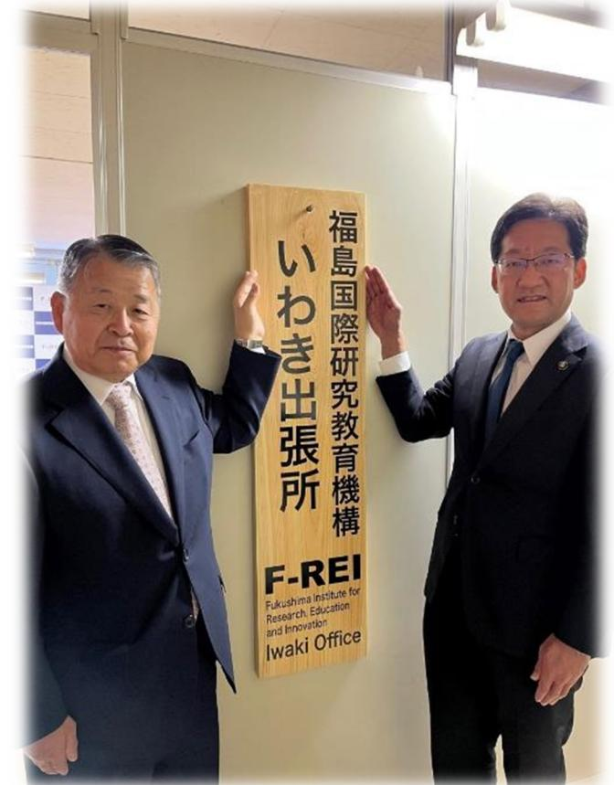

#### **令和5年4月15日(土) いわき市との基本合意書の締結**

4月15日、F-REIいわき出張所開所式 の開催にあわせ、いわき市とF-REIとの連 携協力に関する基本合意書を締結しま した(3件目)。

これに基づき、いわき市との間で双方の資 源を有効的に活用した協働活動を推進 してまいります。

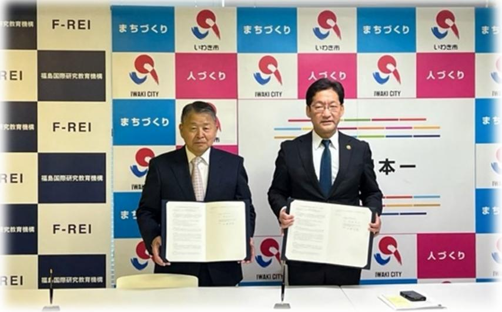

#### **令和5年4月15日(土) F-REI設立記念シンポジウムの開催**

4月15日、福島県をはじめ国内外の 方々に、F-REIの役割、機能、今後の 活動計画等を国内外に発信するため、 F-REI設立記念シンポジウムを主催い たしました。

国内外の関係者をお招きし、同時にオ ンライン配信を行うことによって、F-REI の取り組み・方向性を知っていただく重 要なキックオフとなりました。

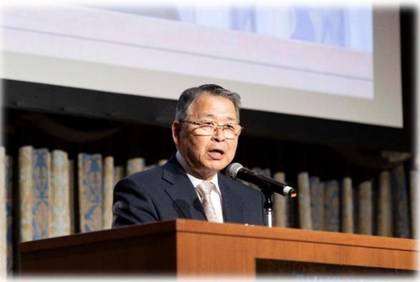

#### **令和5年4月19日(水) ICRU国際シンポジウム 開催**

4月19日、国際放射線単位測定委員会 (ICRU)の委員をお招きし、ICRU国際 シンポジウムを開催いたしました。

山崎理事長によるF-REIの事業紹介、6 名の有識者の方々からテーマに沿った詳細 な講演、総合討論が行われました。

※シンポジウムについては、福島国際研究教育機構(F-REI)、産業技術総合研究所計量 標準総合センター(NMIJ/AIST)、国際放射線単位測定委員会(ICRU)の三者主催 の形式により開催されました。

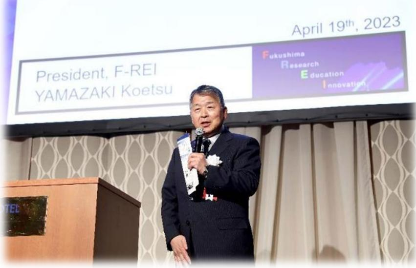

#### **令和5年4月28日(金) 令和5年度の年度計画及び助成等業務実施計画を公表**

4月28日、福島復興再生特別措置法の規定に基づき、令和5年度の研究開 発等業務の運営に関する計画(年度計画)及び助成等業務に係る実施計画 (助成等業務実施計画)を公表しました。

中期目標で掲げられた「基盤づくりと存在感の提示」に向け、設立初年度における 計画を達成できるよう、しっかりと取り組んでまいります。

○年度計画

https://www.f-rei.go.jp/assets/contents/2023_annual_plan_.pdf

○助成等業務実施計画 https://www.frei.go.jp/assets/contents/Implementation_Plan_for_Grant_of_Su bsidies_and_Other_Activities.pdf

### **令和5年5月1日(月) アドバイザリーボードのメンバーの決定**

5月1日、アドバイザリーボードのメンバーと して出席し、F-REIの運営全般や、各事業 の状況等について、幅広い見地に立った大 所・高所からのご助言をいただくため、4名の 有識者にアドバイザーとしてご就任いただくこ ととなりました。

今後、アドバイザーからのそれぞれのご知見・ ご経験に基づく情報やご助言等を踏まえつ つ、F-REIの活動の各方面への展開に向け て、一層推進してまいります。

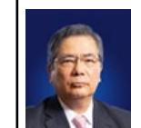

石村 和彦(いしむら かずひこ) 産業技術総合研究所理事長 永田 恭介(ながた きょうすけ) 筑波大学長、国立大学協会会長 原山 優子(はらやま ゆうこ) 元 総合科学技術・イノベーション会議 常勤議員

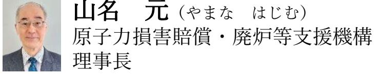

#### **令和5年5月8日(月) 理事長特別顧問の決定**

5月8日、広い業務を的確に実施していくた め、外部有識者によるアドバイザー体制の一 環として、2名の有識者に理事長特別顧問 としてご就任いただくことといたしました。

今後、理事長特別顧問それぞれのご知見・ ご経験に基づく情報やご助言等を踏まえつつ、 「創造的復興の中核拠点」を目指し、各種 の取組を推進してまいります。

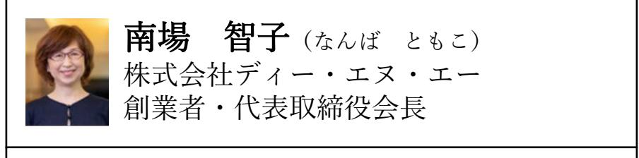

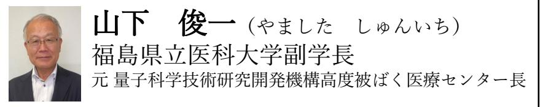

#### **令和5年5月10日(水) 第1回新産業創出等研究開発協議会の開催**

5月10日、第1回新産業創出等研究開 発協議会を大熊町で開催しました。

復興庁など7府省庁や県、浜通り地域等 15市町村、大学、研究機関など35団体で 構成され、会合では、協議会運営要領や ワーキンググループの設置、中期目標及び中 期計画等、当面のスケジュールについて確認 しました。

第2回会合は9月以降の開催を予定して おり、F-REIの事業全般について、様々な関 係機関で協議し、研究開発や広域連携など 進めてまいります。

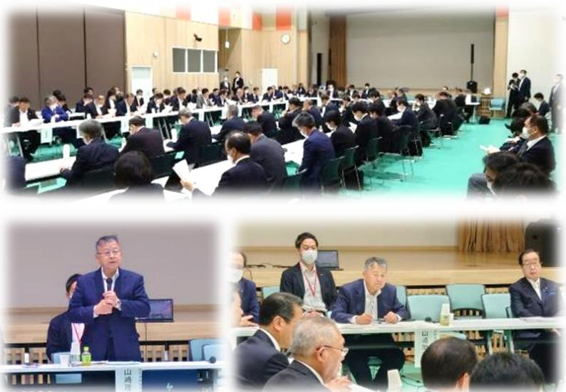

#### **令和5年5月17日(水) 福島大学との基本合意書の締結**

5月17日、福島大学とF-REIとの連携 協力に関する基本合意書を締結しました (4件目)。

今後、この基本合意書に沿って、包括的 な連携協力を進め、両者間で進めている 先行研究に加え、福島をはじめ東北の復 興を実現するための研究開発や人材育 成等を加速してまいります。

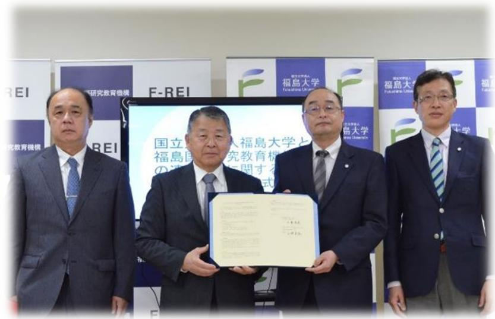

### **令和5年5月17日(水) 第1回F-REIトップセミナーの開催(福島大学)**

5月17日、第1回F-REIトップセミナーを福島大学 で開催しました。

本セミナーは、福島の創造的復興と発展を中長期 的に支える地域の未来を担う若者世代等を対象と した人材育成の取組の一環として、F-REIの役員等 が講師となり、最先端の科学技術の魅力と可能性 等を学生・生徒へ伝えるものです。

第1回は、講師は理事長の山崎光悦が務め、演題 を「福島大学食農学類の皆さんへ ~これからどう過 ごす?大学ライフのススメ~」とし、福島大学食農学 類1年生の約100名を対象に行いました。今後も 県内各地で順次開催してまいります。

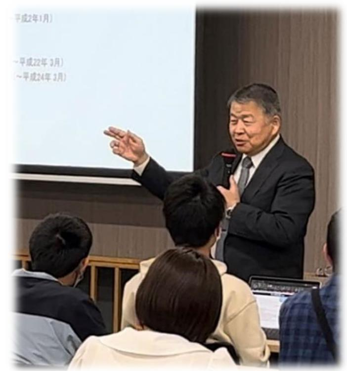

#### **令和5年5月26日(金) 東北経済連合会 産業経済委員会での講演**

5月26日、東北経済連合会 産業経済委員会が 仙台で開催され、山崎理事長が講演しました。

東北経済連合会は、主として東北6県・新潟の 計7県において経済活動を展開している企業、団 体など約800社を超える会員で構成する総合経済 団体であり、東北の復興と発展に向けた活動を行っ ています。

今回、演題を「創造的復興 福島国際研究教育機 構(F-REI)の取り組み~世界最高水準の研究 推進と成果の社会実装・産業化~」とし、現地、オ ンラインで参加した本会員企業経営者などの約100 名に対して、F-REIの事業紹介や最近の活動報告 等を行いました。

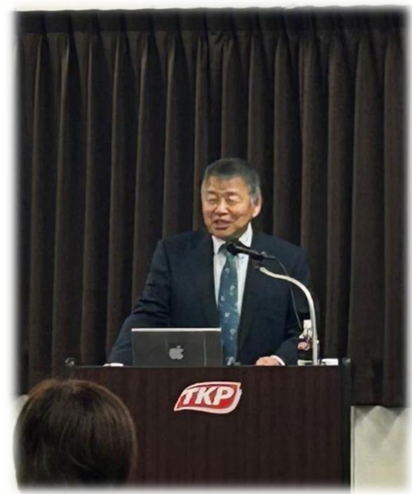

#### **令和5年5月29日(月) 浪江町との基本合意書の締結**

5月29日、浪江町とF-REIとの連携協 力に関する基本合意書を締結しました (全体では5件目、自治体としては2件 目)。

これに基づき、浪江町との間で双方の資 源を有効的に活用した協働活動を推進 してまいります。

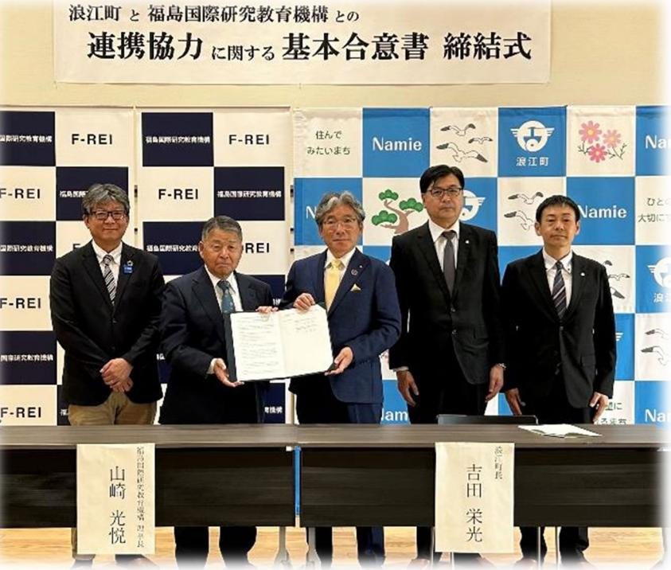

#### **令和5年5月30日(火) 会津大学との基本合意書の締結**

5月30日、会津大学とF-REIとの連携 協力に関する基本合意書を締結しました (6件目)。

今後、この基本合意書に沿って、包括的 な連携協力を進め、会津大学には国際 的な教育・研究環境が整備されており、 非常に有用な連携となることを期待してい ます。

#### **令和5年5月30日(火) 第2回F-REIトップセミナーの開催(会津大学)**

5月30日、第2回F-REIトップセミナーを 会津大学で開催しました。

第2回は、講師は理事長の山崎光悦が務め、 演題を「会津大学コンピュータ理工学部の皆さ んへ ~これからどう過ごす?大学ライフのススメ ~」とし、会津大学コンピュータ理工学部1年 生などの約240名を対象に行いました。

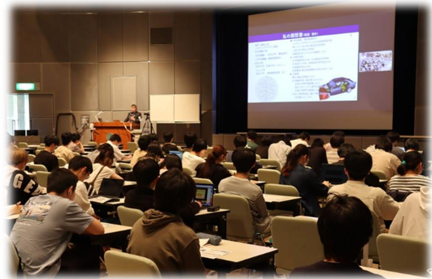

#### **令和5年6月13日(火) 第3回F-REIトップセミナーの開催(相馬高校)**

6月13日、第3回F-REIトップセミナーを 相馬高校で開催しました。

第3回は、講師は執行役の大和田裕二が務 め、演題を「私の研究とF-REI(エフレイ)」と し、相馬高校2年生の約160名を対象に行い ました。

大和田執行役からは自身の専門分野である 解剖学、神経科学での教育・研究の経験を踏 まえ、受講者に対して"教育、研究、イノベー ションの重要性"を説き、受講した高校生は熱 心に話を聞いていました。

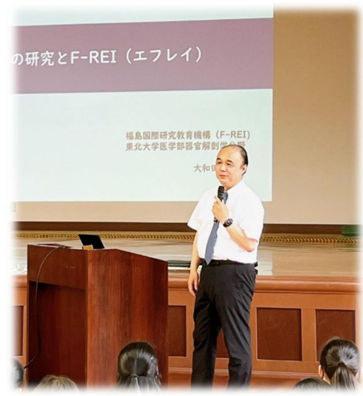

#### **令和5年6月20日(火) 市町村座談会の開催(いわき市)**

6月20日、第1回目となる市町村座談 会をいわき市で実施いたしました。

座談会に先立ち、市内の農業法人、エ ネルギー関連の企業を訪問し、視察及び 意見交換を行ったほか、座談会では、地 域で活躍されている方々や企業等の経 営者等にご参加いただき、多くのご意見を いただきました。

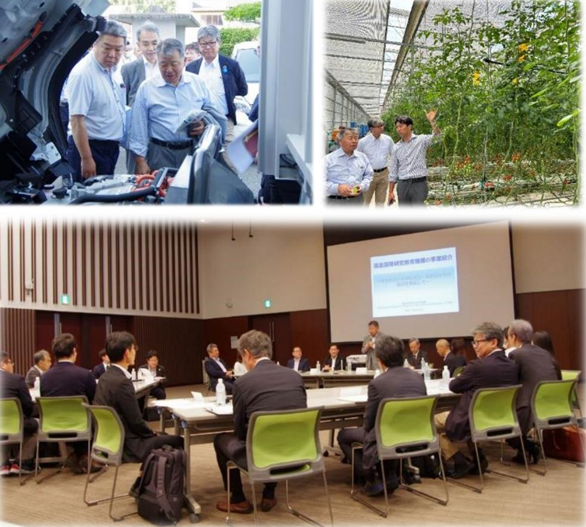

#### **令和5年6月30日(金) 第4回F-REIトップセミナーの開催(会津学鳳中学校・高校)**

6月30日、第4回のトップセミナーを会津学 鳳中学校・高校で開催しました。

講師を執行役の大和田祐二、演題を「私の医 学研究とF-REI(エフレイ)」とし、中学校3 年生、高校全学年を対象に行いました。

受講した約680名の生徒からは、「医学の話が 聞けて面白かった。」や「説明が分かりやすかっ た。」などの感想が聞かれ、中学生にも分かりや すいように工夫した医学の話が大変好評でした。

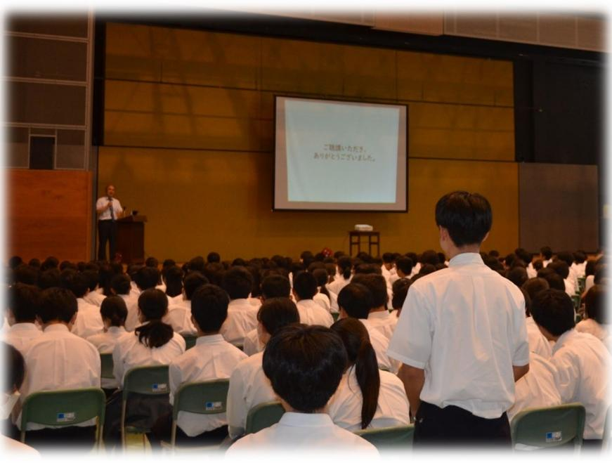

#### **令和5年7月4日(火) 第5回F-REIトップセミナーの開催(会津高校)**

7月4日、第5回のトップセミナーを会津高校 で開催しました。

講師は監事の中西友子が務め、演題は「植物 の謎:私の歩んできた道」とし、2年生約240 名を対象に行いました。

中西監事からは自身の経歴や研究成果が紹 介され、受講した生徒が進路などを考えるきっ かけとなっていました。講演後に質問をする生徒 もいて、講演内容への関心の高さがうかがえま した。

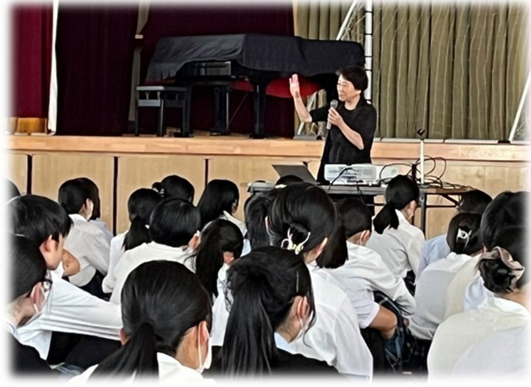

#### **令和5年7月5日(水) 市町村座談会の開催(南相馬市)**

7月5日、第2回目となる市町村座談 会を南相馬市で実施いたしました。

座談会に先立ち、市内の農業法人、ワク チンを製造する企業、ロボット関連企業を 訪問し、視察及び意見交換を行ったほか、 座談会では、地方創生に向けて事業構 想を学ぶ南相馬市プロジェクト研究員の 方から多くのご意見をいただきました。

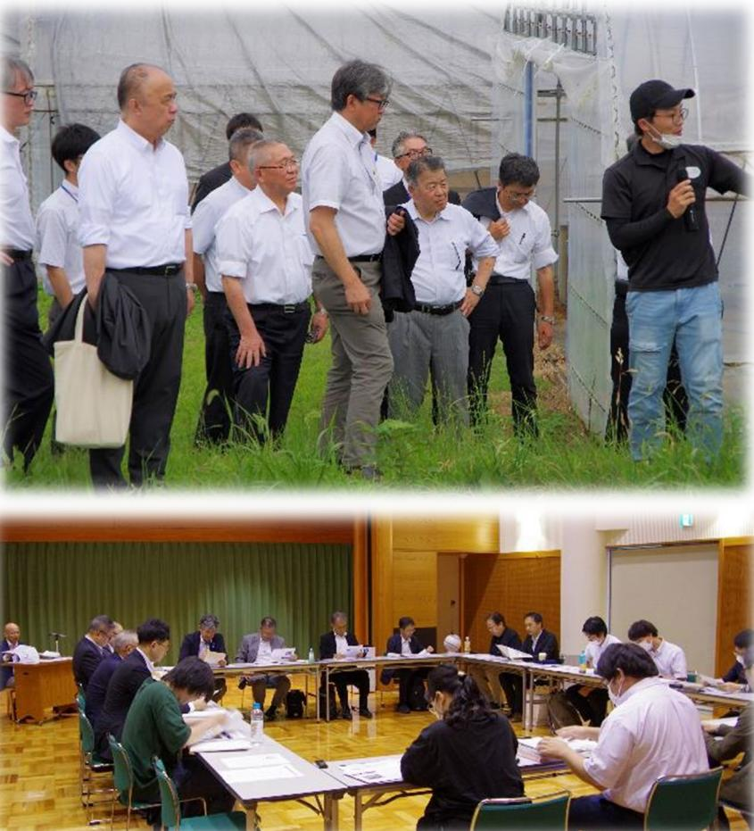

#### **令和5年7月13日(木) 第6回F-REIトップセミナーの開催(小高産業技術高校)**

7月13日、第6回のトップセミナーを小高産 業技術高校で開催しました。

講師は監事の森下信が務め、演題は「福島国 際研究教育機構 目指すロボット研究」として、 2年生約100名を対象に行いました。

森下監事からは、「残念ながら我が国のロボット 研究は世界最先端からは周回遅れにあり、F-REIではそれを挽回するために最先端ロボット 研究を進めたいと考えている。将来的に、皆さ んに研究を進める手伝いをしていただきたい。」 との熱いメッセージを送っていました。

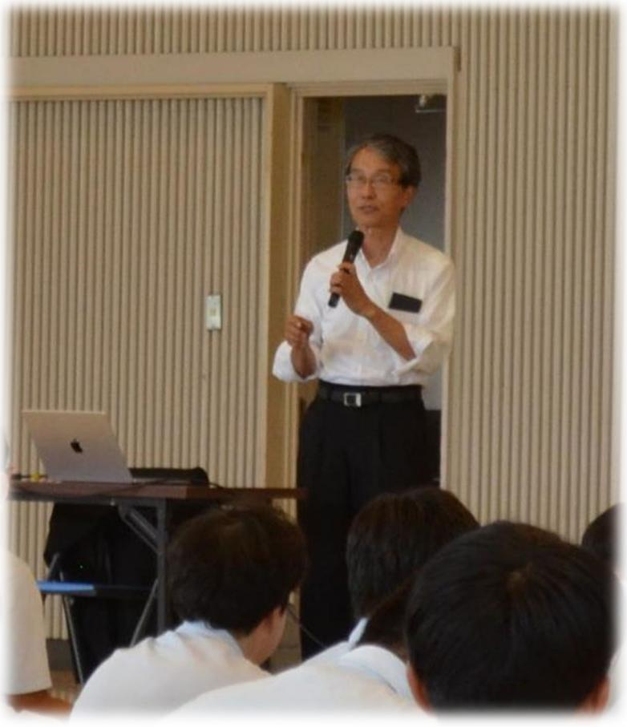

### **令和5年7月14日(金) 分野長・副分野長の決定**

7月14日、各分野における研究開発を 戦略的に推進していくため、各分野におい て専門的知見を有する外部の研究者9 名を分野長、副分野長に就任いただくこ とといたしました 。

分野長は、担当する分野における研究課 題を具体化し、研究の進め方等に係る 調整・管理を行い、また、将来のF-REIの 研究グループの確保に向けた調整など、 研究に関する総括的な業務を行います。 副分野長は分野長を補佐し、また、分野 長とは異なる専門的知見に基づく研究課 題の調整等を行います 。

|  | 【分野長】野波 健蔵(のなみ けんぞう) |
| --- | --- |
| ロボット | 一般社団法人日本ドローンコンソーシアム 会長 |
|  | 【副分野長】松野 文俊(まつの ふみとし) |
|  | 大阪工業大学工学部電子情報システム工学科 特任教授 |
|  | 【分野長】佐々木 昭博(ささき あきひろ) 東京農業大学総合研究所 参与(客員教授)、 |
| 農林水産業 | 元農業・食品産業技術総合研究機構 副理事長 |
|  | 【副分野長】荒尾 知人(あらお ともひと) |
|  | 元農業・食品産業技術総合研究機構 中央農業研究センター 所長 |
|  | 【分野長】矢部 彰(やべ あきら) 新エネルギー・産業技術総合開発機構 |
|  | 技術戦略研究センター フェロー |
|  | 【副分野長】秋田 調(あきた しらべ) |
| エネルギー | 一般財団法人電力中央研究所 名誉特別顧問 |
|  | 【副分野長】錦谷 禎範(にしきたに よしのり) |
|  | 早稲田大学ナノライフ創新研究機構 |
|  | ナノテクノロジー研究所 招聘研究員 |
| 放射線科学 | 【分野長】片岡 一則(かたおか かずのり) 公益財団法人川崎市産業振興財団 |
|  | ナノ医療イノベーションセンター長 |
| ・創薬医療 | 【副分野長】山下 俊一(やました しゅんいち) |
|  | 福島県立医科大学副学長、元量子科学技術研究開発 |
|  | 機構高度被ばく医療センター長 |

#### **令和5年7月27日(木) 市町村座談会の開催(葛尾村)**

7月27日、第3回目となる市町村 座談会を葛尾村で実施いたしました。

座談会に先立ち、村内の酪農家、 農業法人、エビの陸上養殖を行う企 業を訪問し視察及び意見交換を 行ったほか、座談会では、地域で活 躍されている方々や企業等の経営 者のほか、大学の先生にもご参加い ただき、多くのご意見をいただきました。

#### **令和5年8月3日(木) F-REIロゴマーク選考委員会を開催**

8月3日、全国から応募いただいた F-REIロゴマーク125作品の中から選 考を進めるため、第1回選考委員会 を開催しました。

選考委員には、山崎理事長の他、 浜通り地域等をはじめとする福島県 ゆかりの、デザイン関係の経験豊かな 5名の方に参画をお願いしました。

福島の創造的復興の中核拠点を 目指すF-REIを象徴するものとして ふさわしいロゴマークを選考してまいり ます。

岡部 兼芳(おかべ たかよし) はじまりの美術館 館長

加賀 美子(かが よしこ) デザイナー、地域おこし協力隊

瀬川 彩那(せがわ あやな) 高校生

西山 里佳(にしやま りか) Marutt株式会社 代表

馬場 立治(ばば たつはる) アートディレクター、 Plan Vie株式会社 代表取締役

山崎 光悦(やまざき こうえつ) 福島国際研究教育機構 理事長

#### **令和5年8月9日(水) 市町村座談会の開催(浪江町)**

8月9日、第4回目となる市町村座談会 を浪江町で実施いたしました。

座談会に先立ち、水素エネルギー実証施 設、農業法人、集成材製造施設、コンク リート製品製造企業を訪問し視察及び意 見交換を行ったほか、座談会では、地域で 活躍されている方々、小中学校の校長の ほか、まちづくり団体の方にもご参加いただ き、多くのご意見をいただきました。

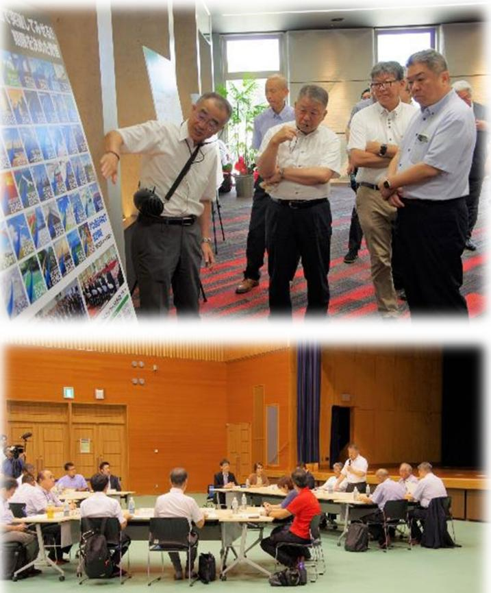

#### **令和5年8月29日(火) 市町村座談会の開催(田村市)**

8月29日、第5回目となる市町村座談 会を田村市で実施いたしました。

座談会に先立ち、植物工場、森林組合、 ピーマン、ホップ生産農家、バイオマス発電 所を訪問し視察及び意見交換を行ったほ か、座談会では、地域で活躍されている 方々、立地企業の代表の方々、地元高校 の先生と生徒にもご参加いただき、多くのご 意見をいただきました。

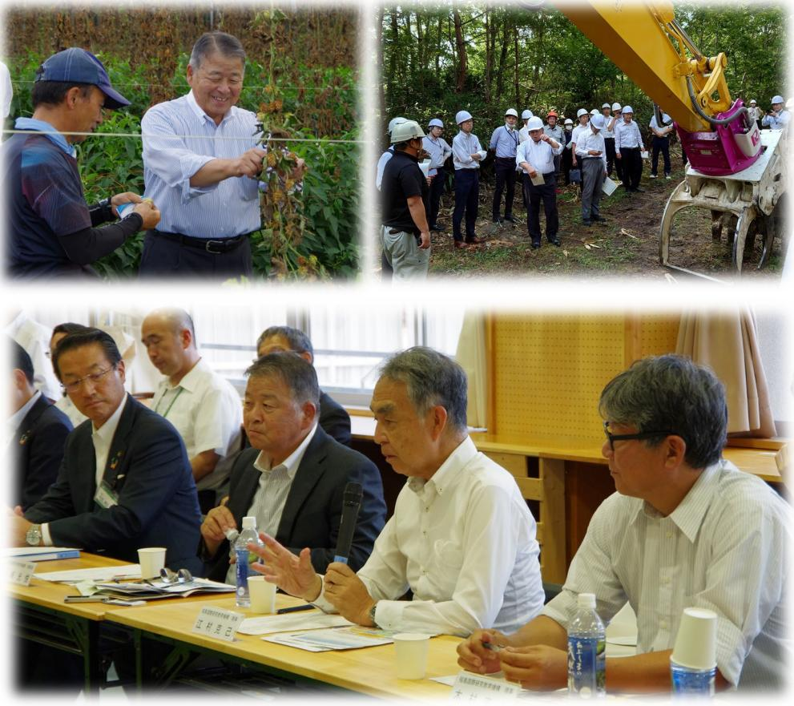

#### **令和5年8月31日(木) 第7回F-REIトップセミナーの開催(安積高校)**

8月31日、第7回のトップセミナーを安積高校 で開催しました。

講師は執行役の大和田祐二が務め、演題を 「私の医学研究とF-REIが目指すもの」とし、 2年生を中心とした約40名を対象に行いました。

大和田執行役からはこれまでの自身の経験を 踏まえ、「医学の進歩は研究とイノベーションに よって生まれる。物事を懐疑的にみる視点も必 要だ。」と伝え、最後には「様々な経験が皆さん の将来の糧となります。高校生活を楽しんでくだ さい。」とのメッセージを送っていました。

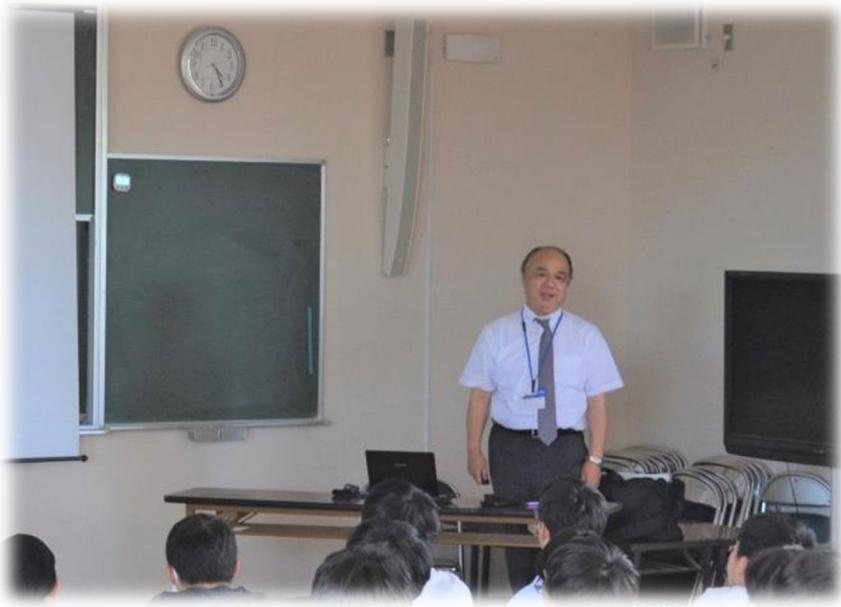

#### **令和5年9月1日(金) 南相馬市との基本合意書の締結**

9月1日、南相馬市とF-REIとの連携協力に 関する基本合意書を締結しました(全体では 7件目、自治体としては3件目)。これに基づ き、南相馬市との間で双方の資源を有効的に 活用した協働活動を推進してまいります。

また、基本合意書の締結に先立ち、南相馬市 主催の「福島イノベーション・コースト構想の推 進に関する勉強会」において、山崎理事長が 講演を行い、県立小高産業技術高校の生徒 をはじめ約200名の市民に向けて F -REIの概 要等について説明を行いました。

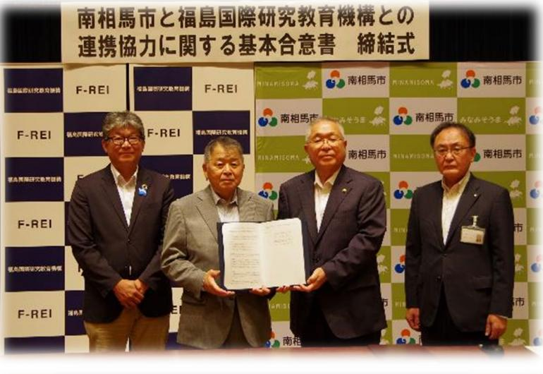

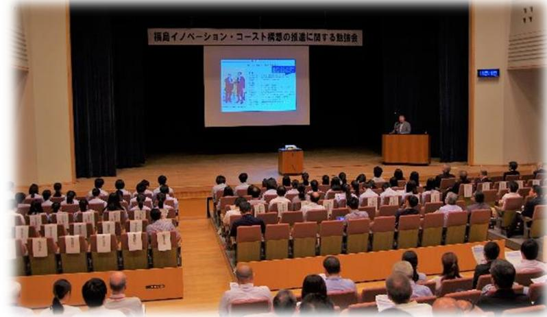

#### **令和5年9月12日(火) 第8回F-REIトップセミナーの開催(ふたば未来学園高校)**

9月12日、第8回のトップセミナーをふたば未来学園 高校で開催しました。

講師は理事長の山崎光悦が務め、演題を「ふたば未 来学園高校のみなさんへ ~未来のリーダーとなるため に~」とし、ふたば未来学園高校2年生の約130名を 対象に行いました。考え抜く力の重要性などを説くととも に、「後悔がないように頑張れ!」とエールを送りました。

また、トップセミナーに先立って、同会場にて、福島県高 等学校教育研究会理科部会第75回総会並びに令 和5年度研究大会が開催され、福島県内高校の理 科教員の先生方(約80名)に対して、理事長の山 崎光悦が「これからの高校理科教育が目指すべき方向 は?」の演題で講演し、高校理科教育の目指すべき 方向を考えるきっかけとしていただきました。

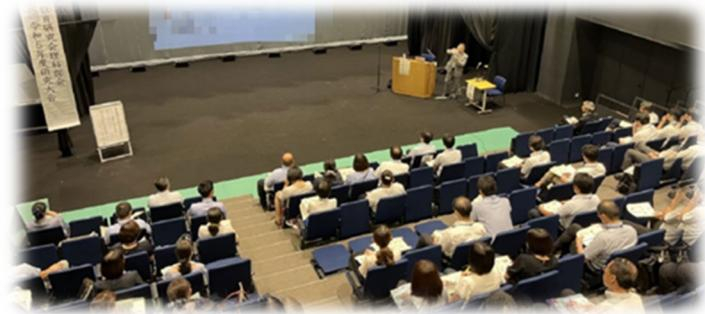

#### **令和5年9月25日(月) 第9回F-REIトップセミナーの開催(福島工業高等専門学校)**

9月25日、第9回のトップセミナーを福島 工業高等専門学校で開催しました。

講師は監事の森下信が務め、演題を「福島 国際研究教育機構 ロボットの知能化研 究」とし、機械システム工学科と電気電子シ ステム工学科の3年生の約70名を対象に 行いました。

森下監事からは「人まねや流行ではなく、独 自に新しい領域を切り開く姿勢が重要だ」と の話があり、活発な質疑応答も行われ、盛 況のうちに終えました。

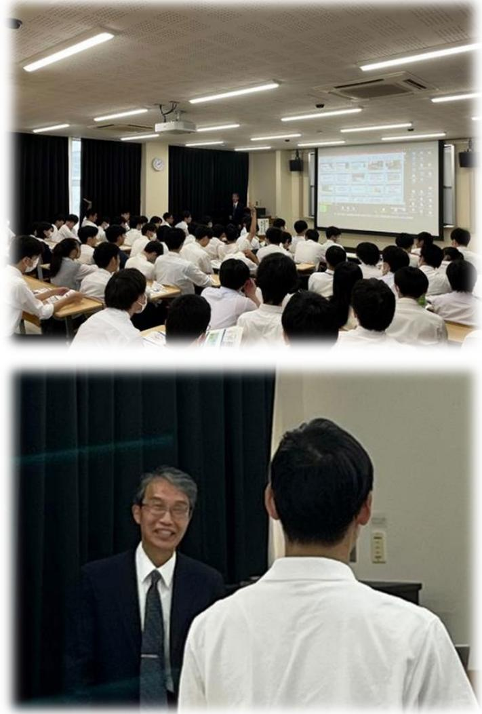

#### **令和5年9月26日(火) 第10回F-REIトップセミナーの開催(福島工業高等専門学校)**

9月26日、第10回のトップセミナーを福島 工業高等専門学校で開催しました。

講師は理事長の山崎光悦が務め、演題を 「21世紀を生き抜く諸君に伝えたいこと~ 福島工業高等専門学校の皆さんへ~」とし、 化学・バイオ工学科、都市システム工学科、 ビジネスコミュニケーション学科の3年生の約 120名を対象に行いました。

山崎理事長からは、"高専で学ぶことの重 要性"や、"科学技術の可能性"の話があり、 受講した生徒にとって今後の進路を考える 良いきっかけになりました。

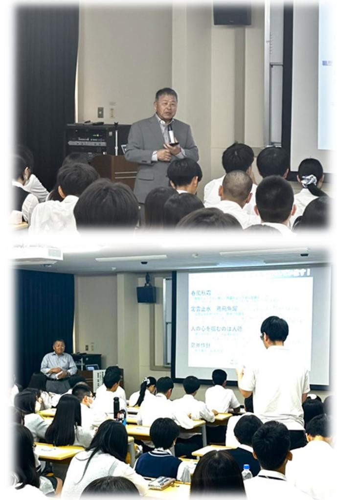

#### **令和5年9月27日(水) 第1回広域連携ワーキンググループの開催**

9月27日、第1回広域連携ワーキング グループ(WG)を開催いたしました。 このWGでは、研究開発、産業化、人 材育成等の効果が広域的に波及するよ う、福島浜通り地域等を中心とする市 町村等による様々な形でのパートナー シップによる連携等について調査及び検 討を行います。

第1回目となるWGは、楢葉町で開催 し、復興庁から概算要求、施設整備に ついての御報告、F-REIから研究公募 の状況についての報告、広域連携に関 する取組について説明等があった後、意 見交換を行いました。 43

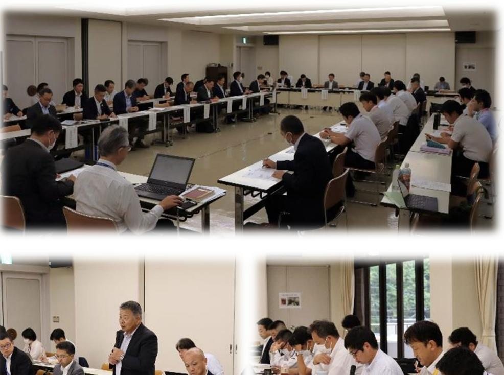

#### **令和5年9月29日(金) 市町村座談会の開催(広野町)**

9月29日、第6回目となる市町村座談 会を広野町で実施いたしました。

座談会に先立ち、火力発電所、バナナ栽 培施設、大学のサテライト研究室を訪問し 視察及び意見交換を行ったほか、座談会 では、地域で活躍されている方々、立地企 業の代表の方々、東京大学と福島高専の 教授にもご参加いただき、多くのご意見をい ただきました。

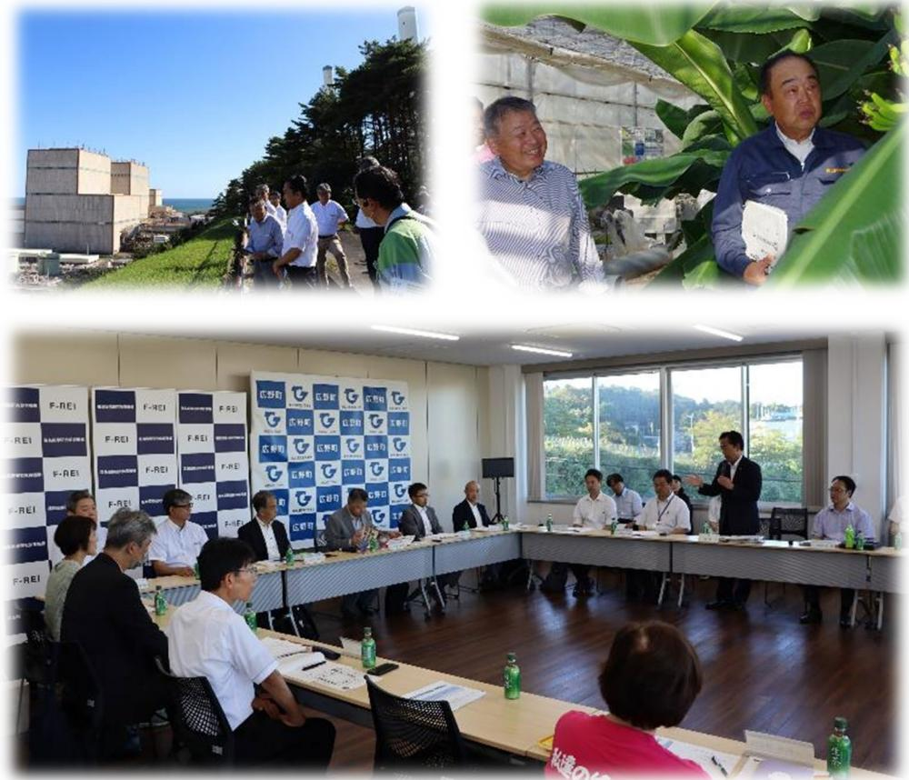

#### **令和5年10月4日(水) 第12回F-REIトップセミナーの開催(福島高校)**

10月4日、第12回のトップセミナーを福島高 校で開催しました。

講師は執行役の大和田裕二が務め、演題を 「私の医学研究とF-REI」とし、約50名の医学 コースを希望する1年生が熱心に耳を傾けてい ました。

大和田執行役は、医学の進歩は研究とイノ ベーションによって生まれることなどを説き、「経 験(新しい出来事や友人・教師との出会い) が皆さんの将来の糧となります。高校生活をエ ンジョイしてください!」とメッセージを伝えました。 和やかな雰囲気の中、生徒からは次々と質疑 がなされ、好評のうちに終えました。

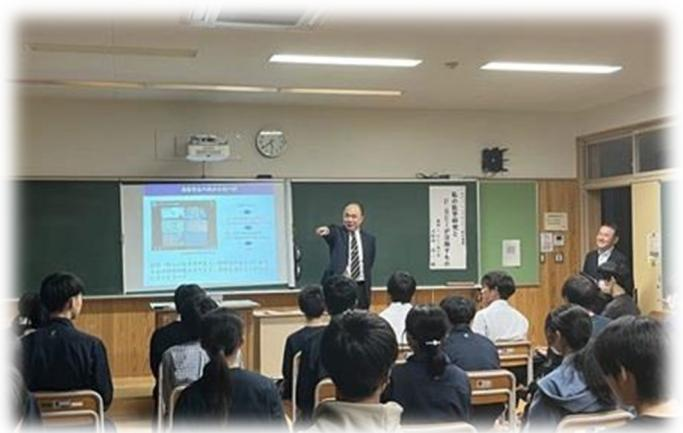

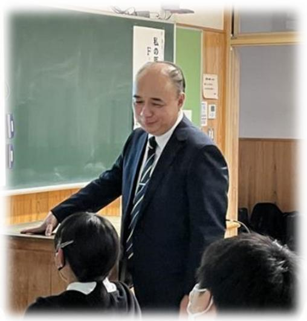

#### **令和5年10月4日(水) 第11回F-REIトップセミナーの開催(福島県立医科大学)**

10月4日、第11回のトップセミナーを福島 県立医科大学で開催しました。

講師は監事の中西友子が務め、演題を 「アイソトープと放射線は新しい研究を拓く 素晴らしいツール」とし、1年生の約180名 を対象に行いました。

中西監事は自身の専門分野である、植物 生理学に関する研究内容を紹介され、放 射線は研究の重要なツールであるとも話さ れて、放射線利用の可能性について言及 していました。最先端の研究に触れることが でき、学生にとって良い刺激となりました。

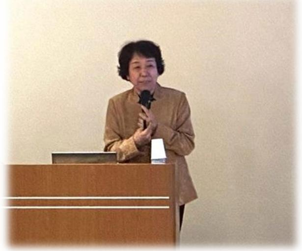

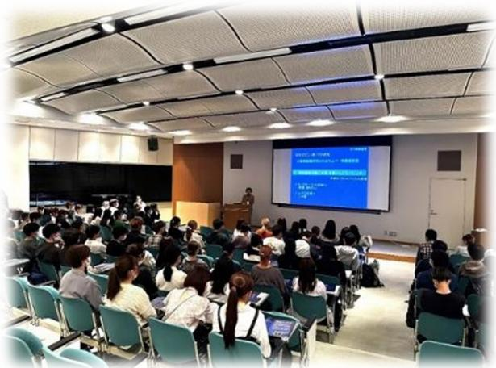

#### **令和5年10月11日(水) 市町村座談会の開催(富岡町)**

10月11日、第7回目となる市町村座談 会を富岡町で実施いたしました。

座談会に先立ち、廃炉関連製品製造企 業、木材(パネルログ)製造企業を訪問 し視察及び意見交換を行ったほか、座談 会では、地域で活躍されている方々、立地 企業の方々、東京農工大の教授にご参加 いただき、多くのご意見をいただきました。

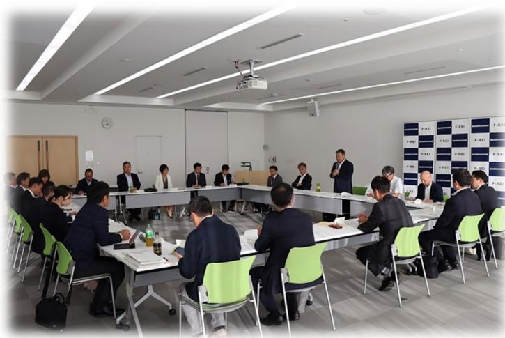

#### **令和5年10月12日(木) 第2回F-REI産学官ネットワーク・セミナーの開催**

10月12日、東北の復興を見据え、東北の企業他を巻 き込んだ産学官の連携体制構築の機会とするため、仙 台で本セミナーを開催しました。

産学官連携・産業化をテーマとして、3名の講師(若生 氏、海老原氏、小池氏)※にご講演いただきました。また、 トークセッションでは、佐々木氏※をモデレータに迎え、講 師3名に江村理事を加えて、これからの産学官連携・産 業化及びF-REIに対する期待についてご議論いただきま した。

※モデレータ:佐々木 啓一(宮城大学長) ※講師:若生 裕俊(富谷市長)、海老原 城一(AiCTコンソーシアム代表理事)、小池 美穂(株式会社 マテリアル・コンセプト代表取締役CEO)

当日は、オンライン参加を含めて156名の民間企業、団 体、大学、地元自治体等の方々にご参加いただき、「F-REIの発信力をもっと高めていくべきである。」といったご意 見をいただきました。

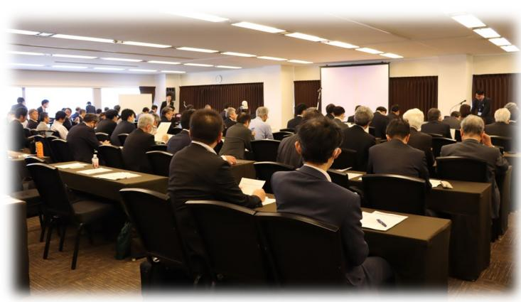

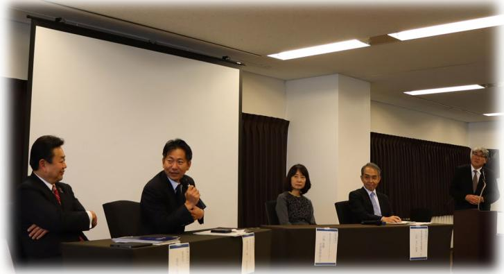

#### **令和5年10月13日(金) 令和5年度第1回アドバイザリーボードの開催**

10月13日、令和5年度第1回アドバイザリーボー ドを開催しました。

F-REIで初めての開催となる今回は、アドバイザーと して、石村和彦 産業総合技術研究所理事長、永 田恭介 筑波大学長、原山優子 東北大学名誉 教授が対面で、山名元 原子力損害賠償・廃炉等 支援機構理事長がオンラインで、それぞれご参加い ただきました。F-REIからは山崎理事長をはじめ、役 員、執行役、分野長、副分野長等が出席しました。

初めに、F-REI側からF-REIの取組紹介を行ったの ち、研究活動の方向性や、拠点形成のあり方等に ついてアドバイザーとの活発な意見交換を通じて有 意義なご助言をいただきました。

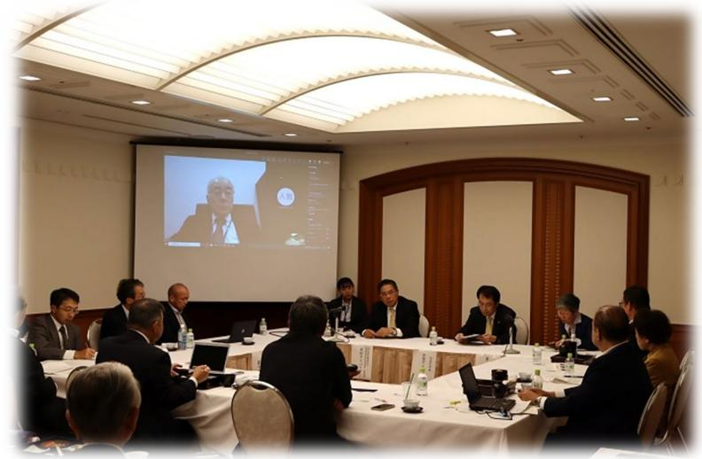

#### **令和5年10 月15日(日) 科学実験教室の開催**

10 月15日、「親子わくわく科学実験教室」 と題し、実験教室を開催いたしました。

当日は、浜通りを中心に県内各地から 6 組 18名の親子にご参加いただき、網倉優子 先生と一緒にペットボトルロケットを自作しま した。その後、ロケットに水を入れて打ち上げ ると、子供たちから歓声が上がり、次はより 飛距離を伸ばそうと試行錯誤しておりました。 打ち上げ後、本物のロケットも何度も失敗 しそのたびに改良され作り上げられていくもの だと先生から教えられると、子供たちは真剣 に聞き入っていた様子でした。

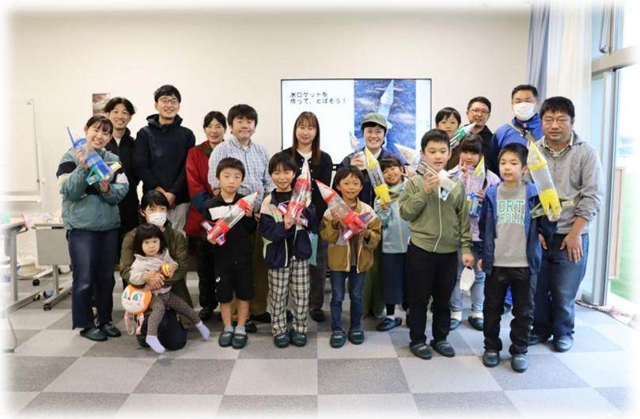

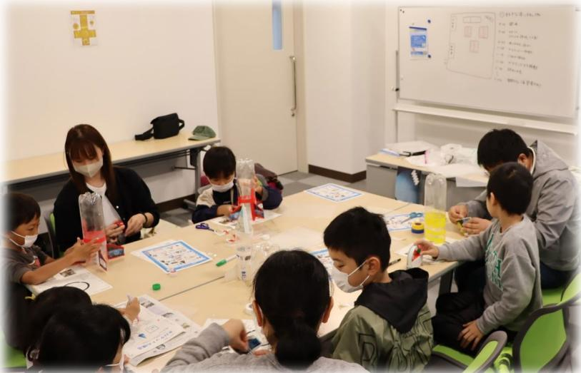

#### **令和5年10月17日(火) 市町村座談会の開催(川内村)**

10月17日、第8回目となる市町村座談 会を川内村で実施いたしました。

座談会では、地域で活躍されている方々、 立地企業の方々、まちづくり団体の方にご 参加いただき多くのご意見をいただきました。 また、座談会のほか、ワイナリー、建設機械 部品製造企業を訪問し視察及び意見交 換も行いました。

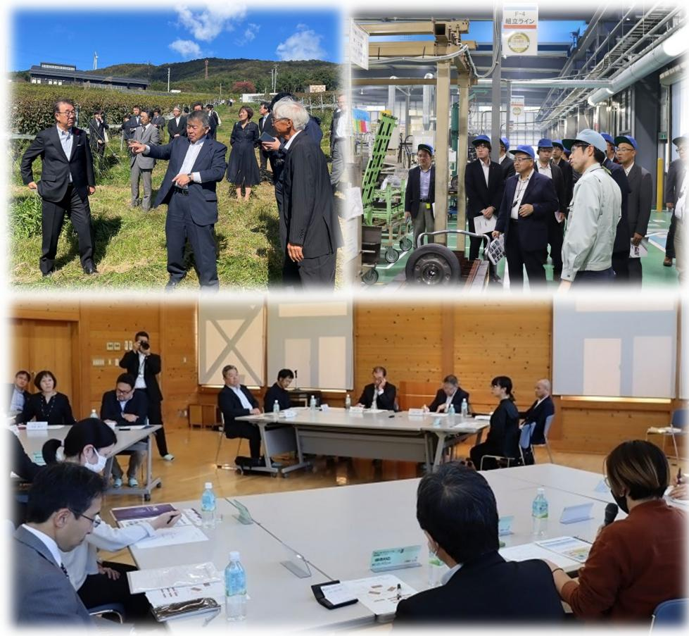

#### **令和5年10月23日(月) 市町村座談会の開催(新地町)**

10月23日、第9回目となる市町村座談 会を新地町で実施いたしました。

座談会に先立ち、天然ガス発電所、樹脂 製品製造工場を訪問し視察及び意見交 換を行ったほか、座談会では、地域で活躍 されている方々、立地企業の方々にご参加 いただき、多くのご意見をいただきました。

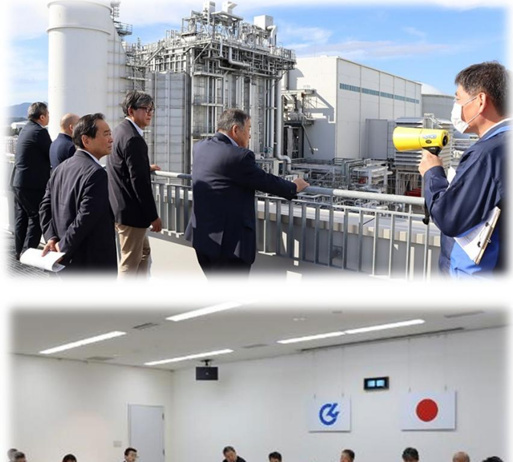

### **令和5年10月26日(木) 出前授業の実施(福島工業高等専門学校)**

10月26日、キャリア教育に関する出前授業を 福島工業高等専門学校(福島高専)で実施 しました。

本出前授業は、福島高専の今年度からの新し い取組であるキャリア教育に関する特別活動に F-REIから講師を派遣したものとなります。

講師は監事の森下信が務め、演題を「「キャリア =将来」について考えよう」とし、機械システム工 学科2年生の約40名を対象に講義しました。 「何のために仕事をするのか」や「学生としての 「今」が将来にどうのように結びつくか」などについて お話ししました。

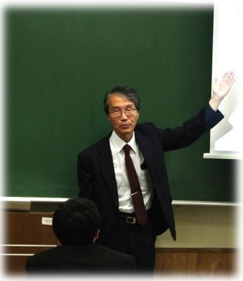

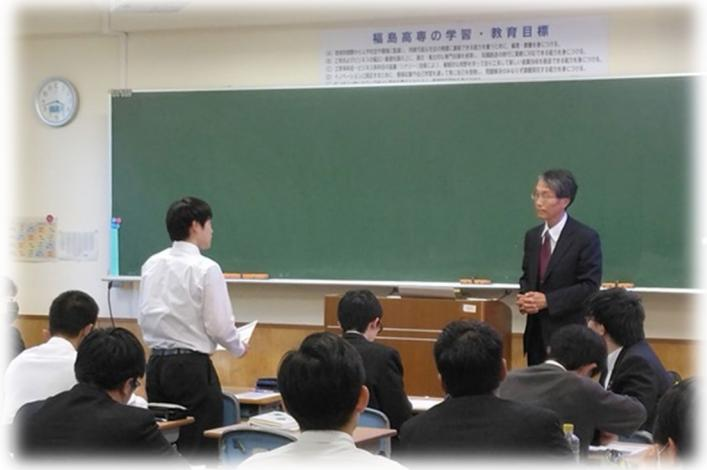

#### **令和5年11月6日(月) 市町村座談会の開催(飯舘村)**

11月6日、第10回目となる市町村座談 会を飯舘村で実施いたしました。

座談会に先立ち、金属製品等製造企業、 木質バイオマス発電所を訪問し視察及び 意見交換を行ったほか、座談会では、地域 で活躍されている方々、地方創生に取り組 まれてる企業の方々にご参加いただき、多く のご意見をいただきました。

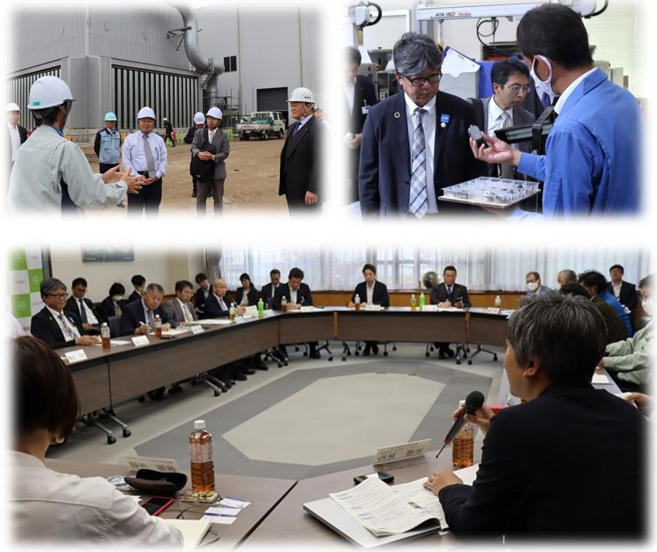

#### **令和5年11月7日(火) 第13回F-REIトップセミナーの開催(東日本国際大学)**

11月7日、第13回のトップセミナーを東日本 国際大学で開催しました。

講師は理事長の山崎光悦が務め、演題を「東 日本国際大学のみなさんへ ~未来のリーダー となるために~」とし、経済経営学部、健康福 祉学部の2年生約60名を対象に行いました。

山崎理事長は、自身の専門分野である材料 力学、計算力学、シミュレーション工学などに関 する研究内容を紹介され、最先端の科学技術 力の魅力と可能性等について学生に伝えてい ました。講演の最後には、「未来のリーダーとな るために、人よりも積極的に様々な経験を積ん でください」とエールを送っていました。

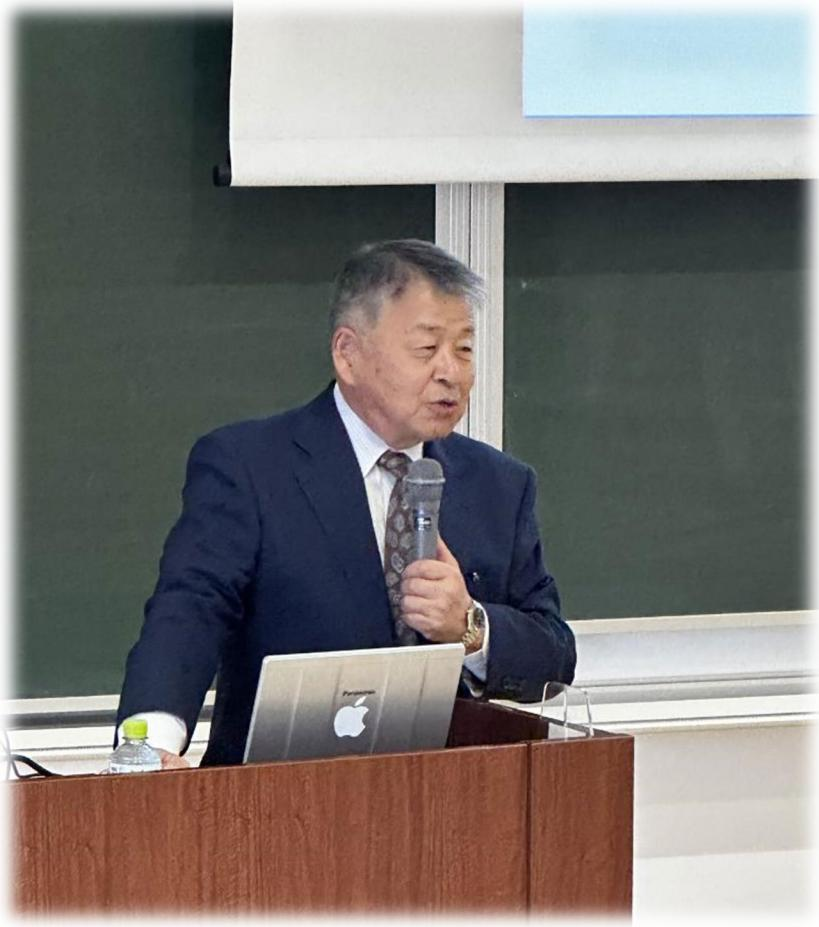

#### **令和5年11 月15日(水) 出前授業の実施(早稲田大学)**

11 月15日、「福島県浜通り地域での魅力的 な取組を知る」をテーマとした出前授業を早稲 田大学早稲田キャンパスで実施しました。

本出前授業は、公益財団法人福島イノベー ション・コースト構想推進機構(イノベ機構)と 連携して実施したものとなります。福島県浜通 り地域等を、自分の夢ややりたいことを実現する 場として考えるきっかけとなることなどを期待して 実施しました。

F-REIからの講師は総務部長の金子忠利が 務め、早稲田大学法学部の 3年生などの約 130名に講義しました。

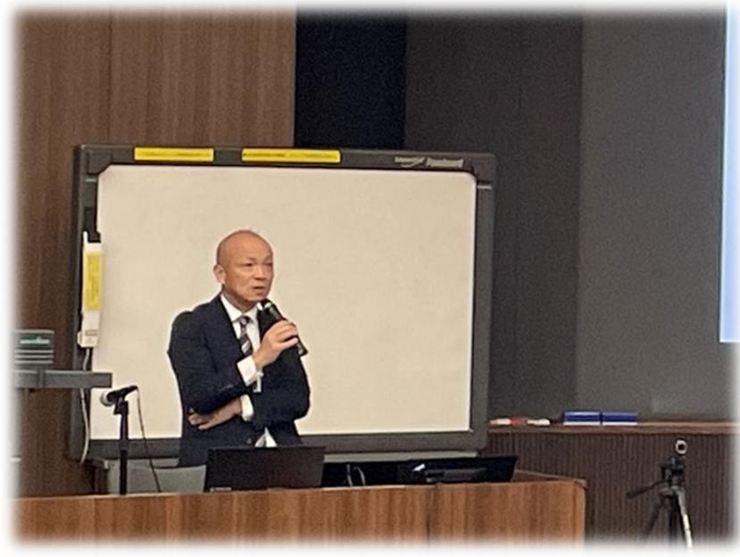

#### **令和5年11月17日(金) 市町村座談会の開催(楢葉町)**

11月17日、第11回目となる市町村座談 会を楢葉町で実施いたしました。

座談会に先立ち、JAEA楢葉遠隔技術開 発センター、甘藷貯蔵施設を訪問し視察 及び意見交換を行ったほか、座談会では、 地域で活躍されている方々、立地企業の 方々、まちづくり団体の方にご参加いただき、 多くのご意見をいただきました。

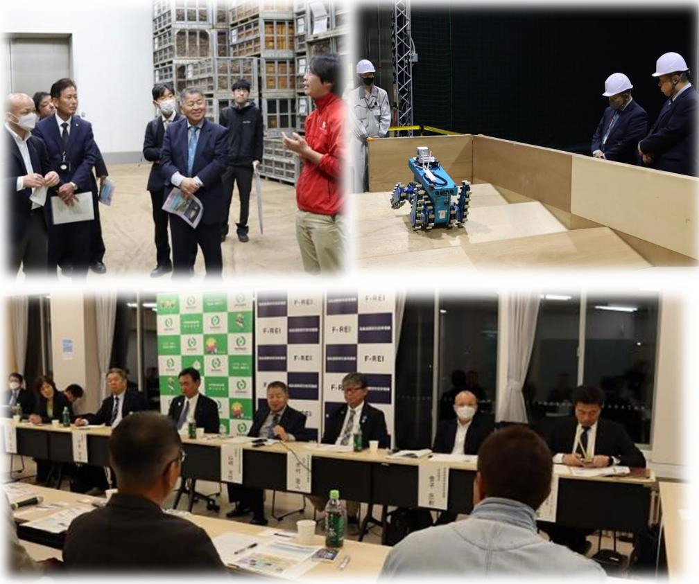

#### **令和5年11月21日(火) 教職員への講演会の実施(福島工業高等専門学校)**

11月21日、福島工業高等専門学校(福島 高専)において、同教職員を対象にした講演 会を実施しました。

理事長の山崎光悦が「大学改革の経験を基 盤に福島国際研究教育機構設立への挑戦」 と題して、F-REI設立の経緯や概要、今後の 計画、そして、福島高専に期待することなどにつ いて語りました。

本講演会は、今年4月1日に締結した研究開 発や人材育成等に関する連携協力に関する 基本合意書に基づいた取組の一環として実施 したもので、教職員約60名がF-REIとのさらな る連携協力の可能性について熱心に考えられ ていました。

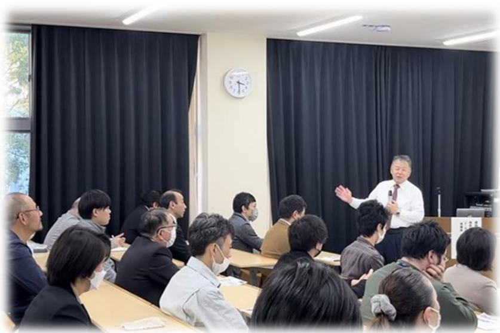

#### **令和5年11月24日(金) 会津大学の学生等へのF-REI説明会の実施**

11月24日、会津大学、ふたば未来学園高等 学校の学生約40名(インド、インドネシア、ガ ンビア、カンボジア、コンゴ民主共和国、ミャン マー、中国、ドイツからの留学生を含む。)を対 象としたF-REI説明会(会場:浪江防災コ ミュニティセンター)を開催しました。今回は、会 津大学のふくしま未来創造プログラムの一部と して実施したものとなります。

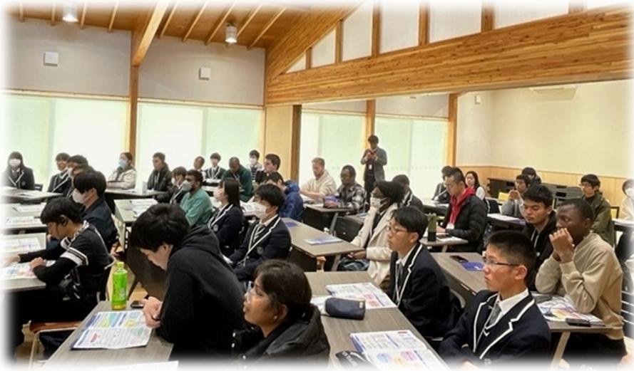

大塚人材育成推進課長が、F-REIの概要や 現在の活動などを説明し、参加者からは「外国 人研究者はどのように採用するのか」「外国人 研究者はどの程度の割合になるのか」「F-REI はどのような組織と連携していくのか」「F-REIを なぜ福島に置くことになったのか」など、次々に質 問が出て、活発な質疑がなされました。

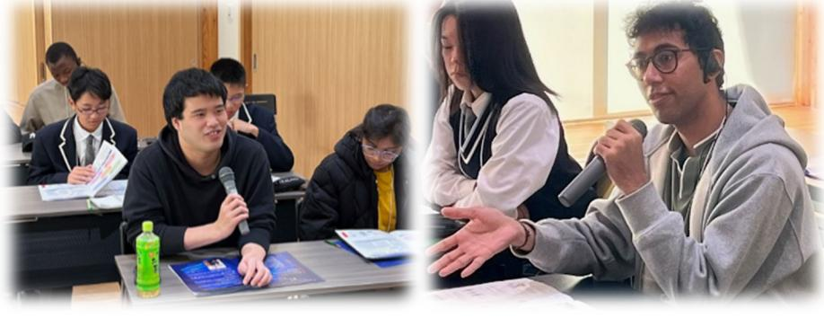

#### **令和5年11月24日(金) 第14回F-REIトップセミナーの開催(福島大学)**

11月24日、第14回のトップセミナーを福島大学 で開催しました。福島大学では第1回トップセミ ナー(5月17日開催/対象:食農学類)に 引き続き、2回目の開催となります。

講師は理事の江村克己が務め、演題を「イノ ベーションを担う人材になろう! ~学生時代に チャレンジして欲しいこと~」とし、共生システム理 工学類の1年生約170名を対象に行いました。

江村理事は、光通信技術の研究者としての経 験を踏まえ、イノベーションとは何か、イノベーション を担う人材となるため、これからの時代に磨くべき 素養とは何かについて話をされ、講演の最後には、 「学生時代を有効に使い、自らやりたいこと、実 現したいことを見出し、学び続けることで役立つ人 材であり続けてください」とエールを送っていました。

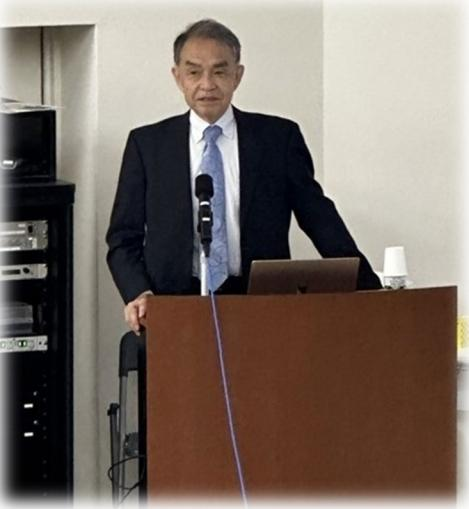

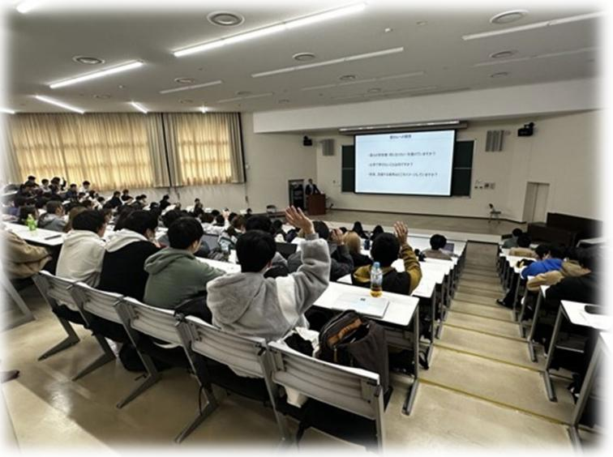

### **令和5年11月26日(日)~12月1日(金) 国際アドバイザーとの意見交換を実施**

11月26日から12月1日にかけて、山崎理事長は欧 州に出張し、F-REI国際アドバイザー4名のうち欧州 に拠点を置く3名(フィオナ・レイモン博士(英国)、 ライムント・ノイゲバウアー博士(ドイツ)、スヴァンテ・ リンドクヴィスト博士(スウェーデン))をそれぞれ訪 問しました。

山崎理事長から各国際アドバイザーに対しF-REIの 事業を詳細に説明し、理解を深めていただくとともに、 F-REIを国際的な研究拠点にするための方途等につ いて意見交換を実施しました。また、山崎理事長から 各国際アドバイザーに、今後の継続的な協力をお願 いしました。

F-REIは引き続き国際アドバイザーから適切な助言を 得つつ、国際化に向けた取り組みを進めてまいります。

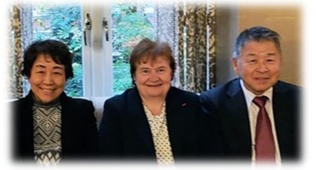

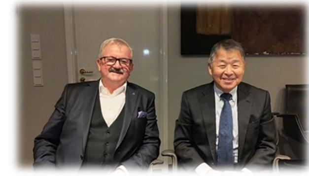

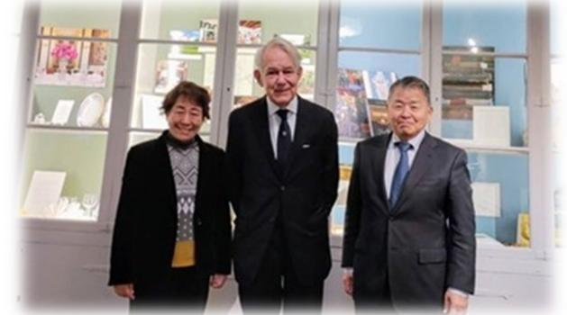

### **令和5年12月1日(金) 第15回F-REIトップセミナーの開催(磐城高校)**

12月1日、第15回のトップセミナーを磐城高 校で開催しました。

講師は監事の森下信が務め、演題を「機械工 学~医工学 最先端研究」とし、普通科2年 生約280名を対象に行いました。

森下監事は、人工知能や医工学などの最先 端研究について紹介し、「皆さんが貢献できる 分野は数多くある。いろいろな分野に興味を 持ってください。」と生徒へ話していました。講演 終了後には活発な質疑応答が行われ、受講 された生徒にとって自らの将来像を考えるきっか けになりました。

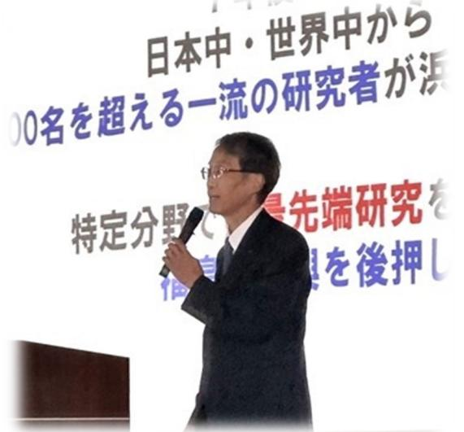

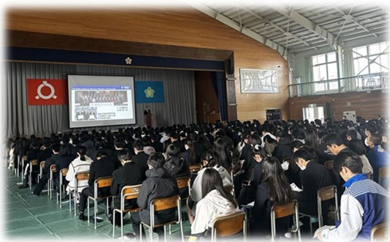

#### **令和5年12月4日(月) 市町村座談会の開催(大熊町)**

12月4日、第12回目となる市町村座談 会を大熊町で実施いたしました。

座談会に先立ち、大熊インキュベーションセ ンター、学び舎 ゆめの森を訪問し視察及び 意見交換を行ったほか、座談会では、地域 で活躍されている方々、立地企業の方々、 大熊町に関係する大学の方々にご参加い ただき、多くのご意見をいただきました。

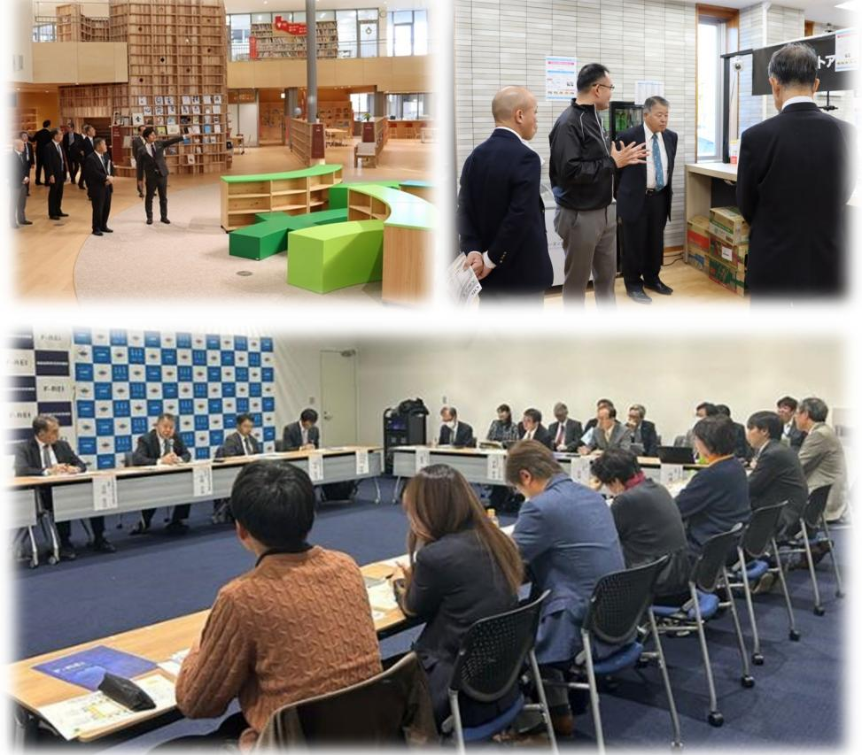

### **令和5年12月7日(木) 第16回F-REIトップセミナーの開催(原町高校)**

12月7日、第16回のトップセミナーを原町高 校で開催しました。

講師は執行役の大和田祐二が務め、演題を 「私の医学研究とF-REI」とし、普通科2年生 約140名を対象に行いました。

大和田執行役は、「医学の進歩は研究とイノ ベーションによって生まれる」「将来、福島あるい は世界を担う人材になっていただきたい」と話さ れ、受講された生徒にとって今後の進路を考え るきっかけになりました。

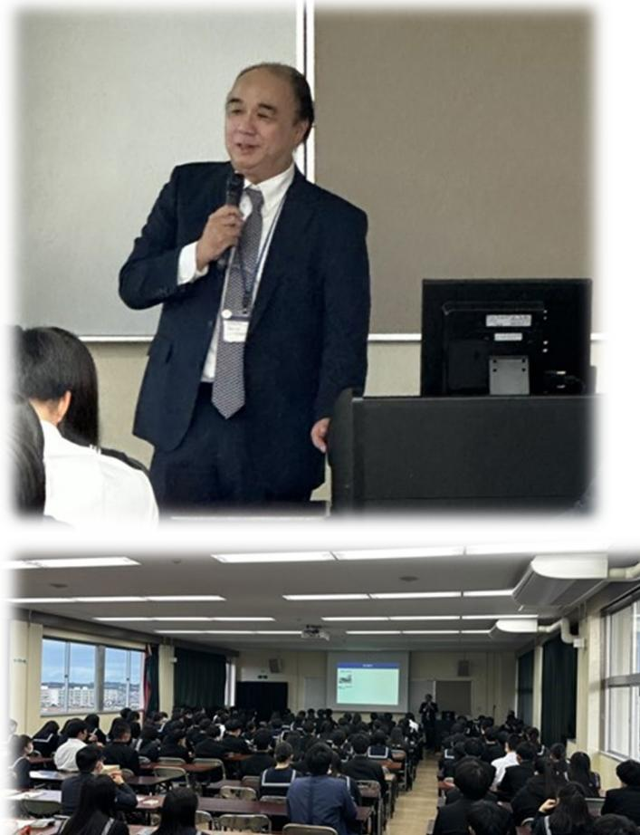

#### **令和5年12月19日(火) 市町村座談会の開催(相馬市)**

12月19日、第13回目となる市町村座談 会を相馬市で実施いたしました。

座談会に先立ち、そうまIHIグリーンエネル ギーセンターとアグリ・コア株式会社を訪問し、 視察及び意見交換を行ったほか、座談会 では、地域で活躍されている方々にご参加 いただき、多くのご意見をいただきました。

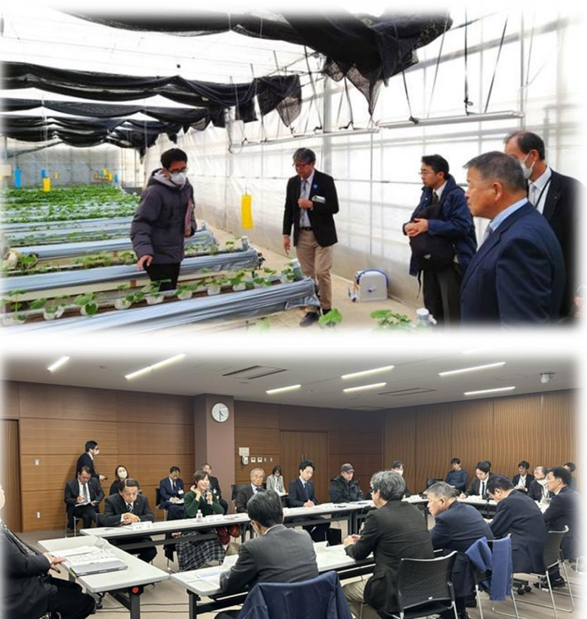

#### **令和5年12月26日(火) 県北・相双地区の自然科学系部活動の高校生へのF-REI説明会の実施**

12月26日、県北・相双地区の高校の自然科学 系部活動部員約20名を対象としたF-REI説明会 (会場:双葉町産業交流センター)を開催しま した。

今回は、福島イノベーション・コースト構想推進機 構様の協力の下、福島県高等学校文化連盟自 然科学専門部県北・相双支部生徒研修会の一 部として実施したものとなります。

大塚人材育成推進課長が、F-REIの概要や将 来の展望、高校生に期待することなどを説明しまし た。

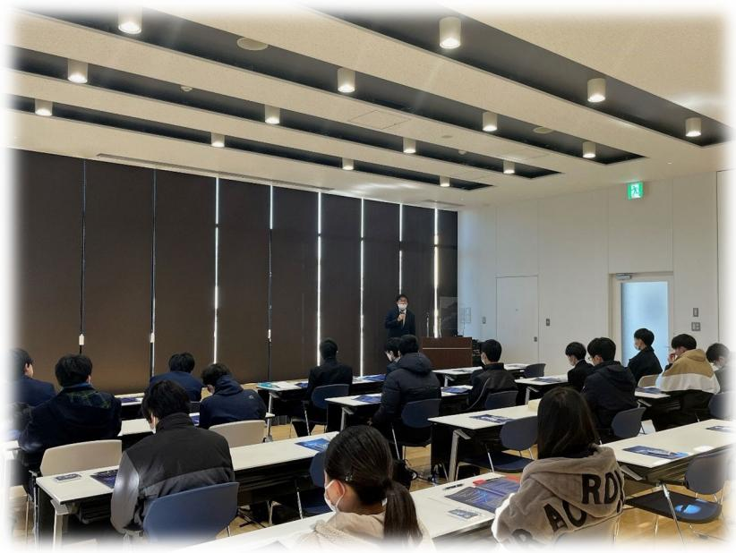

#### **令和6年1月8日(月・祝) エフレイ・サイエンスラボ(体験講座)の開催**

1月8日、エフレイ・サイエンスラボ「放射線をさがせ」 (体験講座)をいわき市で開催しました。

この体験講座は、エフレイによる地域の未来を担う若者 世代の人材育成の取組の一環として、開催したものです。

当日は、10名の小学生と保護者にご参加いただき、4 名の高専生(福島高専)の指導の下で、放射線計測 器を用いて身の回りのもの(食品、塩、肥料など)に含 まれる天然の放射性物質から出る放射線を計測しました。 また、霧箱による放射線可視化の実験では、高専生が 事前に霧が発生する条件やコツを自ら考えた上で小学 生の指導にあたり、参加した小学生全員が霧箱で放射 線の通った跡を実際に見ることができ、小学生からは歓 声が上がっていました。

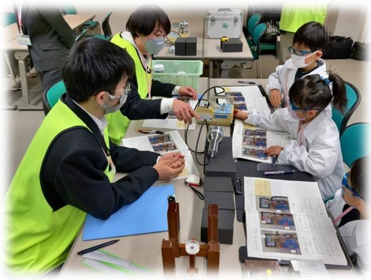

#### **令和6年1月12日(金) 第2回新産業創出等研究開発協議会の開催**

1月12日、第2回新産業創出等研究開発協 議会を富岡町で開催しました。

協議会には、F-REI、復興庁、福島県、研究機 関、関係機関、浜通り地域等15市町村の35の 構成員が参画しています。

会議では、平木大作復興副大臣にもご臨席い ただき、F-REIの活動状況、各ワーキンググルー プの開催内容についてF-REIから、令和6年度 予算概算決定及び施設整備の状況について復 興庁から報告した後、市町村座談会等を通じて 得られた課題等について、構成員による活発な 意見交換が行われました。

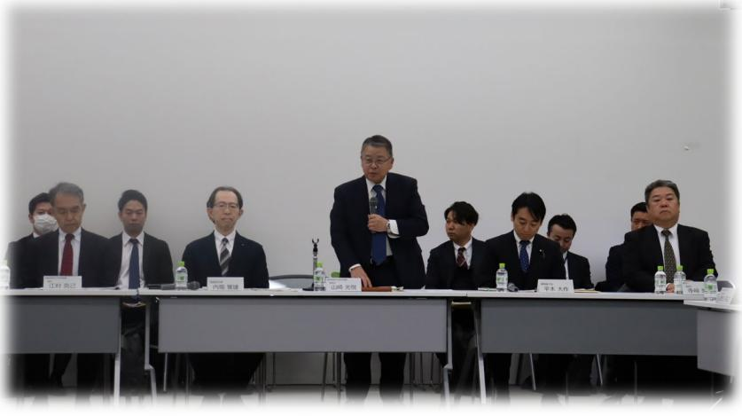

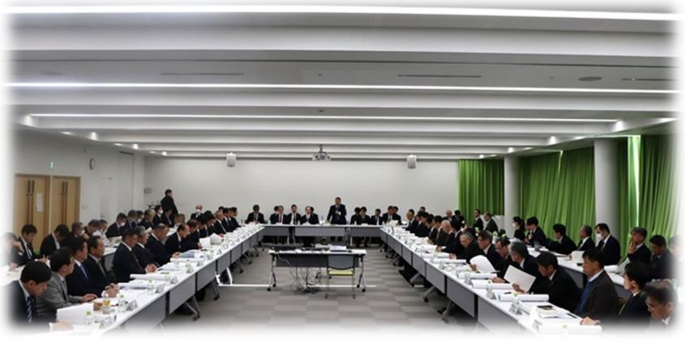

#### **令和6年1月12日(金) F-REIロゴマーク最優秀作品の発表について**

F-REIのロゴマークの募集は、昨年4月21日から 6月30日の期間にかけて行われ、全国125名の 方からの応募があり、有識者による委員で構成さ れる審査委員会や、一般からの意見募集等を 踏まえ、高橋 絢香(たかはし あやか)さんのデ ザインを最優秀作品として決定しました。

F-REIのロゴマーク最優秀作品の決定に伴い、 1月12日、富岡町文化交流センター 学びの森 において、表彰式を開催し、表彰状の授与やロゴ マークの紹介、記念撮影等をとり行いました。

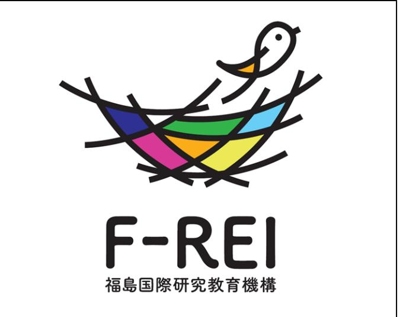

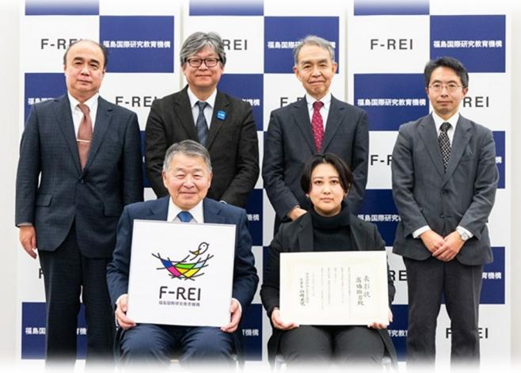

#### **令和6年1月18日(木) 市町村座談会の開催(川俣町)**

1月18日、第14回目となる市町村座談 会を川俣町で実施いたしました。

座談会に先立ち、ベルグ福島株式会社とア サヒ通信株式会社を訪問し、視察及び意 見交換を行ったほか、座談会では、立地企 業の方々、地域で活躍されている方々にご 参加いただき、多くのご意見をいただきまし た。

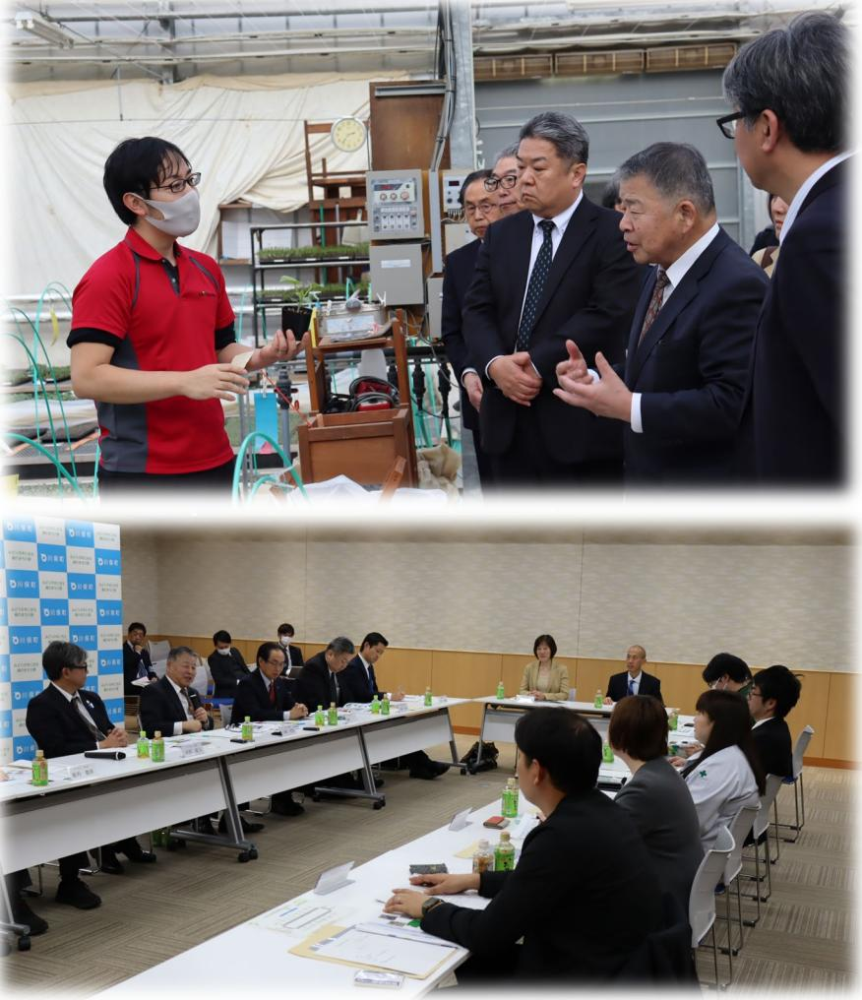

#### **令和6年1月25日(木) 株式会社東邦銀行との包括連携協力協定書の締結**

1月25日、株式会社東邦銀行と F-REIとの連携協力に関する協定 書を締結しました(全体では8件目、 企業としては1件目)。

今後、この協定に基づいて、互恵的 な連携協力を進め、F-REIの認知 度向上、地元企業とのネットワーク 構築、研究成果の社会実装などを 推進してまいります。

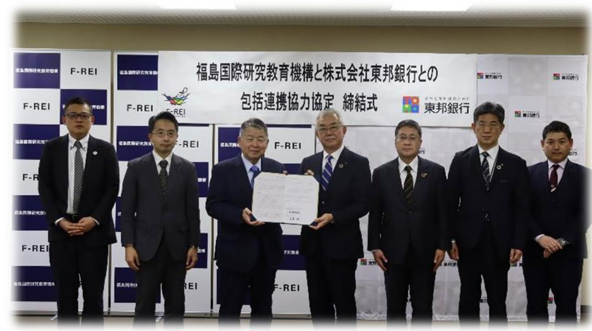

#### **令和6年1月30日(火) 市町村座談会の開催(双葉町)**

1月30日、第15回目となる市町村座談 会を双葉町で実施いたしました。

今回は、株式会社アルメディオ、株式会社 WorldLink & Company、浅野撚糸株 式会社を訪問し、視察及び意見交換を行 いました。

今回が、今年度計画していた浜通り地域 等15市町村での座談会の締めくくりとなりま した。

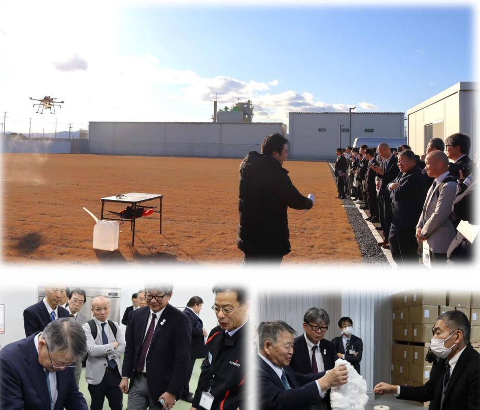

#### **令和6年2月1日(木) 双葉地方町村議会議員研修会での講演**

2月1日、双葉地方町村議会議員研修会において、 同議会議員の方々に対して、理事長の山崎光悦が講 演しました。

演題を「大学改革の経験を基盤に福島国際研究教育 機構設立への挑戦」とし、F-REI設立の経緯や概要、 これまでの活動や今後のビジョン、そして、F-REIと双葉 地方の更なる連携等を念頭に理事長が思い描く浜通 りの将来像などについて語りました。

本講演会は、町村議会議員としての一層の資質向上 と今後の双葉郡の復興・再生に係る政策形成能力の 向上に資するため実施されたもので、参加された双葉 地方の町村議会議員や町村長等約100名の方々は、 理事長のお話に熱心に耳を傾けられていました。

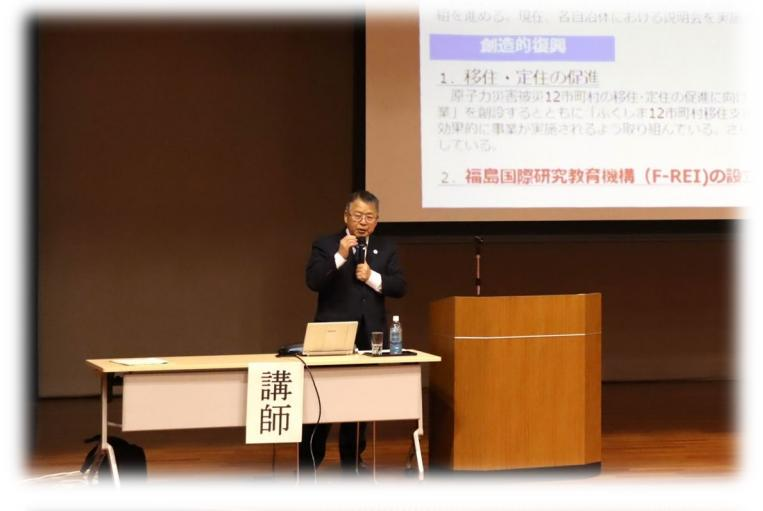

#### **令和6年2月21日(水) 令和5年度第2回アドバイザリーボードを開催**

2月21日、令和5年度第2回アドバイザリーボー ドを開催しました。

アドバイザリーボードには、4名のアドバイザーと F-REIの役員等が出席しました。初めに、F-REIに 関する最近の動向等についてご説明を行ったのち、 研究5分野の方針等についてアドバイザーとの活発 な意見交換を通じて有意義なご助言をいただきま した。

また、アドバイザリーボードの前後にはアドバイザーの 方々に浜通り地域の施設等を見学いただき、地域 に対する理解を深めていただきました。

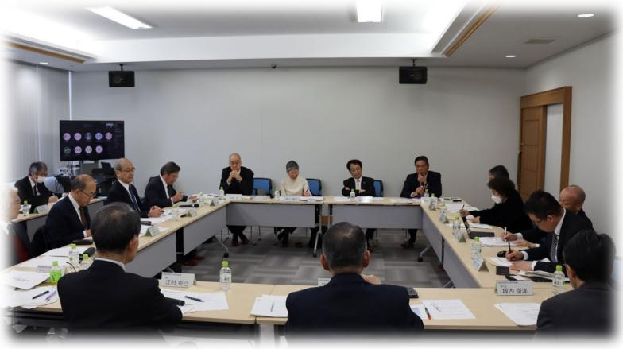

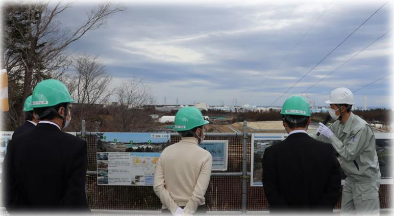

#### **令和6年2月23日(祝・金) エフレイ・フォーラムの開催**

2月23日、いわき市で、エフレイ初となるエフレイ・ フォーラム-環境動態評価を活かしたまちづくり-を 開催しました。

本フォーラムでは「環境動態評価を活かしたまちづ くり」をテーマに、復興・再生まちづくりに向けたエフ レイの活動と森林などの環境中の放射性物質の 動きに関する研究成果等を報告するとともに、パ ネルディスカッションにおいて地域社会や研究・教 育機関等で活動をされている方々とエフレイが果 たす役割や期待することについて、熱く議論が交わ されました。

#### **令和6年3月8日(金) 東北大学との基本合意書の締結**

3月8日、東北大学とF-REIとの連 携協力に関する基本合意書を締結し ました(9件目)。

今後、この基本合意書に沿って、包括 的な連携協力を進め、双方の資源を 有効に用いるなど互恵的な連携協力 を進めていきます。

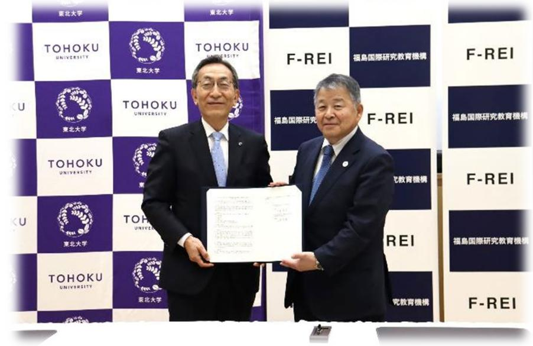

#### **令和6年3月8日(金) 東北大学と連携大学院(連携講座)を設置**

3月8日、東北大学とF-REIは教育・研究 協力に関する協定書を締結しました(連携 大学院としては1件目)。

この協定書に基づき、令和6年4月、同大 大学院医学系研究科医科学専攻に連携 大学院「放射線環境生体医学連携講座」 を開設し、放射線物質を含む種々の環境 物質が人々の健康に与える影響の研究開 発に当たる人材育成を進めます。

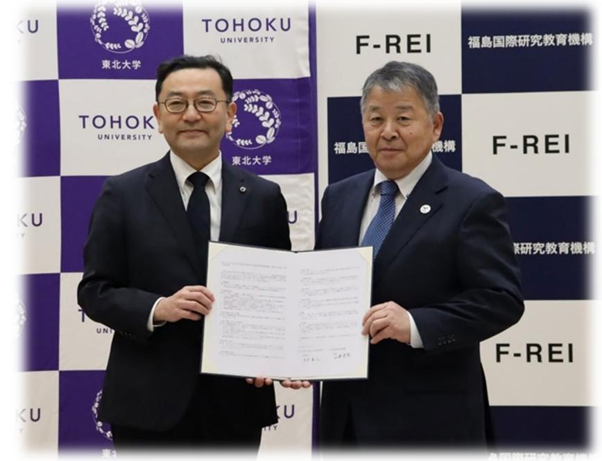

#### **令和6年3月28日(木) 放射性物質の分析人材育成(現地訪問型研修)を開催**

3月28日、放射性物質の分析人材育成 (現地訪問型研修)を開催しました。

この研修は、放射性物質の分析業務に従事す る人材の裾野を広げることを目的に開催したも ので、当日は、廃炉関連企業9名、小高産業 技術高校5名、その他2名の16名の方にご参 加いただき、福島第一原子力発電所、JAEA 大熊分析・研究センター、JAEA廃炉環境国 際共同センターを訪問し、廃炉作業の進捗状 況や放射性物質の分析業務について学びまし た。

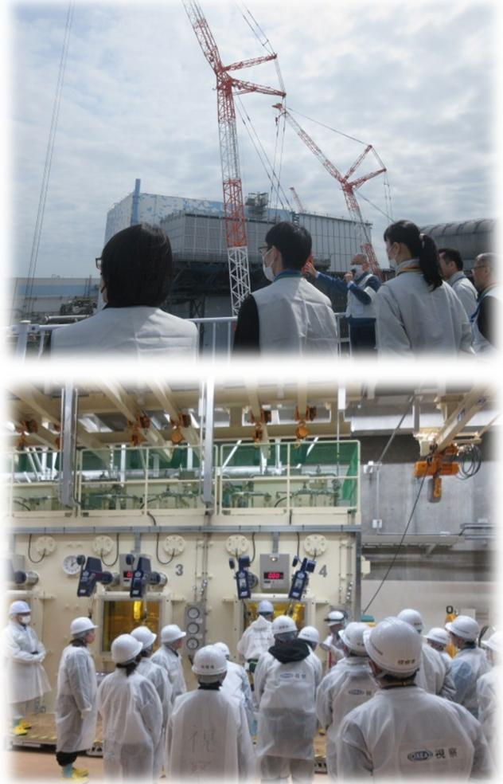

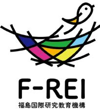

**世界に冠たる 「創造的復興の中核拠点」へ**

